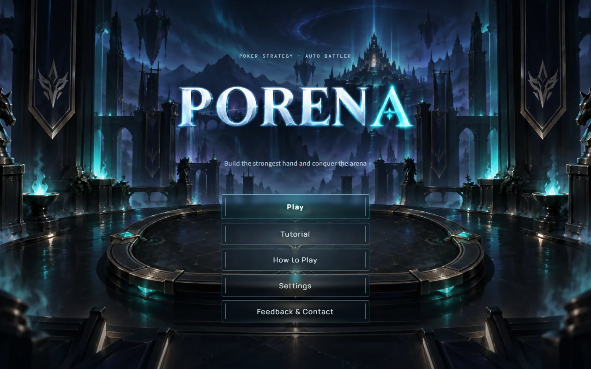
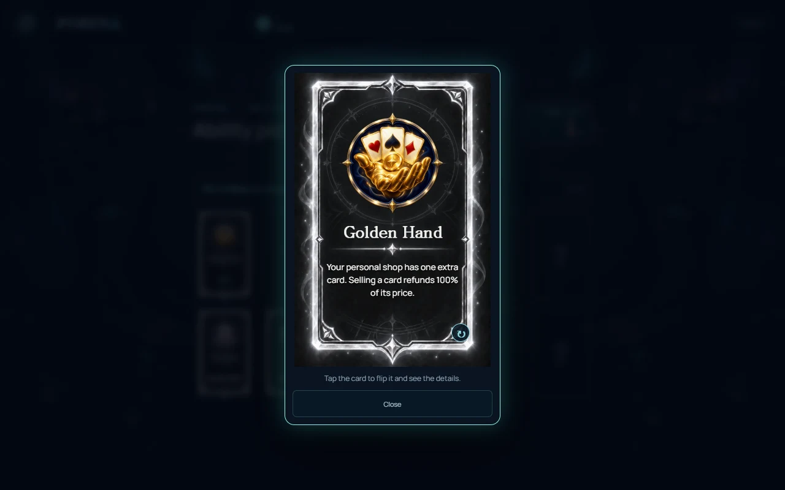
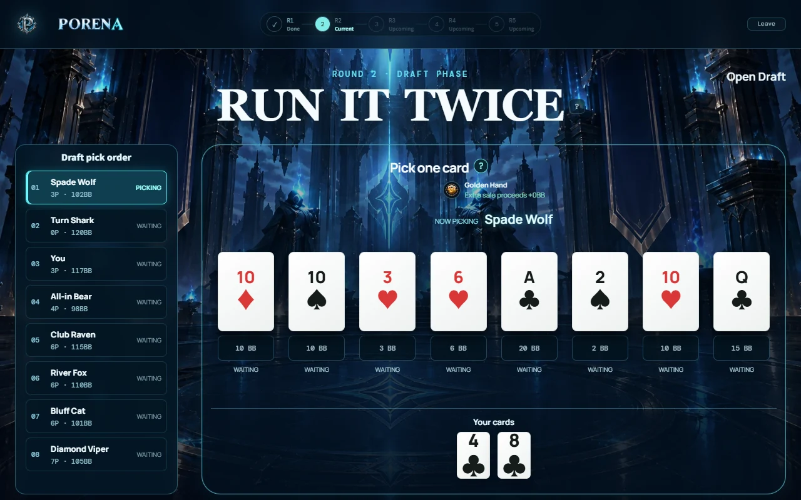
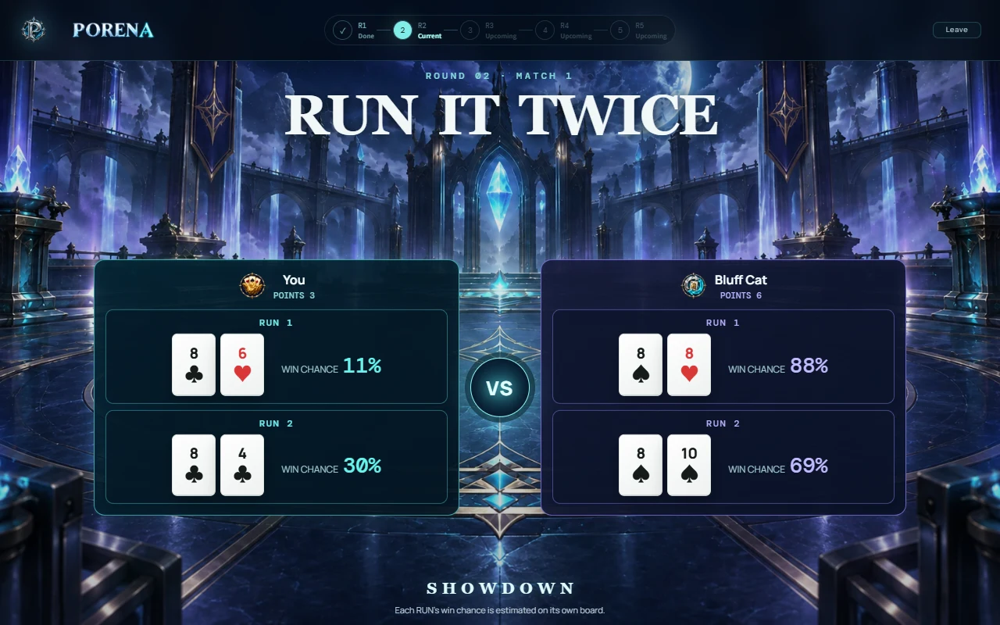
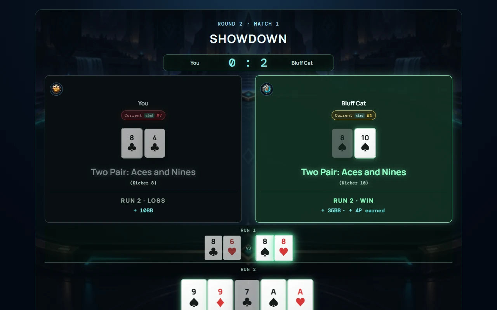
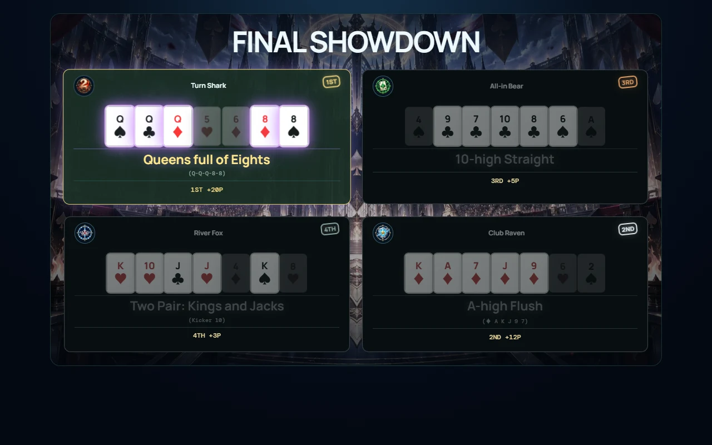
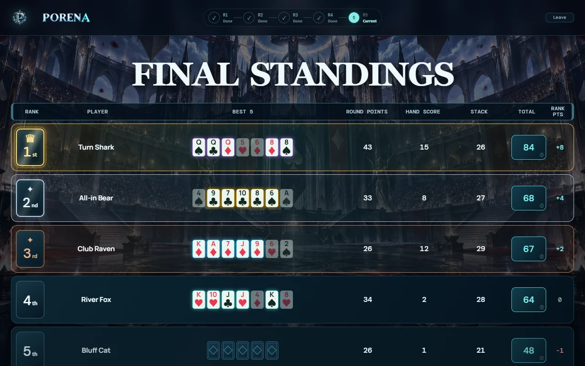

# PORENA

[한국어](README.md) · **English**

> **Tactical Poker Autobattler**



**Design your hand. Rule the arena.**

PORENA is not poker where you wait for good cards. Eight players share **a single 52-card pool**, buying, selling and drafting the cards they need to design their own hand. The poker rules change every round, and the points collected over five rounds decide the winner.

**[▶ Play now](https://porena.kr)** · [GitHub](https://github.com/wlghks4689/holto-chess)

> **Status:** development prototype, playable online
> **Players:** 2–8 humans · AI fills empty seats, so every game has eight
> **Server:** Cloudflare Workers + Durable Objects + WebSocket
> **Languages:** 한국어 · English (picked from your browser language, changeable in Settings)

The in-game **How to Play** has two paths: the *Beginner guide* if you are new to poker, and the *Rule book* if you want rules and numbers right away. This README follows the same order.

---

## New here? — the 5-minute version

1. **Pick an ability.** Before the game starts, choose one of 12 face-down cards to get your own special power.
2. **Collect cards.** Buy cards from your shop with BB, or take one from the open draft. A card someone owns cannot be owned by anyone else.
3. **Fight under each round's rules.** Matches are decided by the poker hand of your best five cards (BEST 5).
4. **Earn points and BB.** In R3 and R4, the two lowest players are eliminated.
5. **After the R5 final, the final score decides the winner.**

```text
R1 8 players ─ R2 8 ─ R3 8 → 6 ─ R4 6 → 4 ─ R5 final standings
                         ▲ 2 out    ▲ 2 out
```

| Round | In one line |
| --- | --- |
| **R1 CLASSIC HOLD'EM** | Your 2 cards + a 5-card board. Three familiar Hold'em matches |
| **R2 RUN IT TWICE** | Draft a third card; one lead card plays in both runs · two matches against different opponents |
| **R3 OMAHA SWISS** | You hold 4 cards but must use exactly 2 of them + 3 board cards. Eliminations begin |
| **R4 BEST FIVE OF TEN** | Your 5 cards + a 5-card board. Split into a winner bracket and a survival bracket |
| **R5 THE LAST HAND** | No board: BEST 5 from your own 7 cards. The final four play it out |

```text
Final score = round points + R5 hand score + ⌊remaining BB ÷ 10⌋
```

Points and BB earned from abilities are not added separately; they are already in the formula above.

---

## Rule book

Every number comes from the game code (`holto-chess/src/game/config.ts`, `engine.ts`, `abilities.ts`), and the in-game rule book reads the same values straight from the code.

### 1. Basics

| Item | Value |
| --- | --- |
| Players | 8 · empty seats are AI |
| Card pool | 52 unique cards, shared |
| Start | 50BB · no starting card (buy both R1 cards in the shop) · 1 ability |
| Round income | +30BB to survivors at the start of R2–R5 |
| Shop cards | R1 4 · R3–R5 2 (no shop in R2) |
| Reroll / lock | 5BB / 3BB |
| Sell refund | 60% of the base price (rounded down) |
| Time limits | Shop 60s · draft 20s per pick · R2 lineup 30s |

| Round | R1 | R2 | R3 | R4 | R5 |
| --- | ---: | ---: | ---: | ---: | ---: |
| Hand size | 2 | 3 | 4 | 5 | 7 |
| Purchase limit | 2 | no shop | 2 | 3 | 3 |
| Reroll limit | 1 | — | 2 | 2 | 3 |

**Card prices (BB)** — A 20 · K 18 · Q 15 · J 12 · T 10 · 9 to 2 cost their rank (9BB … 2BB)

### 2. Shared card pool

- Each of the 52 cards exists once. A card someone owns never appears in another player's shop or draft.
- A card sitting in your shop is also withheld from everyone else while it is there.
- Sold cards and the cards of eliminated players return to the pool.
- Opponents' cards stay hidden until they are revealed at showdown. A board never contains a card owned by that match's players.

### 3. Economy (BB rewards for regular matches)

| Match | Win | Loss |
| --- | --- | --- |
| R1 | 0 | +10 (+5 × losing streak) → 10 · 15 · 20 |
| R2 RUN | 0 | 0 |
| R3 | 0 | +10 (+5 × losing streak) → 10 · 15 · 20 |
| R4 · R5 | 0 | 0 |

Only the losing player earns match BB. A win pays in points only, and a split shares points only. A losing streak counts the losses in a row earlier in the same round and restarts every round. A forfeit for missing cards earns no points and no BB. Round income (+30BB at the start of R2–R5) is unchanged.

### 4. Rounds

| Round | Players | Cards | Matches | Points | Rule | Elimination |
| --- | ---: | ---: | --- | --- | --- | --- |
| **R1** Hold'em Swiss | 8 | 2 | 1-on-1 Swiss ×3 | Win +3P · Split +1P | BEST 5 from 2 hole + 5 board | None |
| **R2** Run It Twice | 8 | 3 | Draft → 1-on-1 match ×2 (2 RUNs each) | Per RUN: win +2P · Split +1P · match sweep +2P (up to 12P) | Lead 1 + support 1 + 5 board | None |
| **R3** Omaha Swiss | 8 | 4 | 1-on-1 Swiss ×3 | Win +4P · Split +2P | Exactly 2 hole + exactly 3 board | Bottom 2 by points |
| **R4** Best Five of Ten | 6 | 5 | Draft → shop → match 1 → groups of 3 | Match 1 win +6P · Split +3P | BEST 5 from 5 hole + 5 board | 2 from the survival bracket |
| **R5** The Last Hand | 4 | 7 | All four at once | +20 / +12 / +5 / +3P | BEST 5 from your 7 cards | Final standings |

- **R2** — There is no personal shop. Arrange your 3 cards as `lead 1 + support 2`: RUN 1 plays lead + support 1, RUN 2 plays lead + support 2, each on its own board. The same lineup plays two matches; the second is against a different opponent with a similar result. Winning both RUNs of a match adds a +2P sweep bonus.
- **R3** — Match 1 pairs players by cumulative points (BB on ties); matches 2 and 3 pair players with similar records.
- **R4** — The 3 match-1 winners enter the winner bracket (1st +10P · 2nd +5P · 3rd +3P; tied 2nd gets +3P each). The 3 losers enter the survival bracket (only 1st survives, +0P).
- **R5** — There is no community board. Tied places share the combined points of those places, split by remaining BB (ICM).

### 5. Open draft (R2 · R4)

R2 reveals 8 cards and R4 reveals 16. Each player takes one card, paying its price in BB. If nothing is affordable, the turn is skipped.

Pick order:

1. The holder of the **First Class** ability
2. Players with **fewer** cumulative points
3. On equal points, players with **more** BB
4. Still tied: random

### 6. Elimination

- **R3**: after three matches, the bottom 2 by cumulative points are eliminated. If the cutoff is tied, the tied players play a **survival tiebreak** on a fresh board (no points or BB; BB never breaks the tie). If three boards all tie, a random rank draw decides.
- **R4**: only the winner of the 3-player survival bracket stays; the other 2 are eliminated.
- When you are eliminated your cards return to the pool, and your placing is fixed by your points at that moment.

### 7. Final score and standings

```text
Final Score = cumulative points + R5 hand score + floor(remaining BB / 10)
```

| Hand | High card | One pair | Two pair | Three of a kind | Straight | Flush | Full house | Four of a kind | Straight flush | Royal flush |
| --- | ---: | ---: | ---: | ---: | ---: | ---: | ---: | ---: | ---: | ---: |
| Score | 0 | 1 | 2 | 5 | 8 | 12 | 15 | 20 | 35 | 50 |

- The four R5 finalists are ranked 1st–4th by final score. On equal scores, the better R5 final placing goes first.
- R4 eliminations take 5th–6th and R3 eliminations take 7th–8th, ordered by points at elimination. BB and hands never move a player out of that band.
- The **rank points** on the results screen (+8 / +4 / +2 / 0 / −1 / −2 / −4 / −8) only label 1st–8th and are not added to the final score.

### 8. Abilities

Before the game, players take turns picking one of 12 face-down cards, so all eight hold different abilities. If time runs out, one of the remaining cards is picked automatically. Match-reward abilities trigger only in **regular matches**; tiebreak boards never pay ability rewards.

| Ability | Effect | Timing · notes |
| --- | --- | --- |
| **Royal Blood** | Unlike everyone else you get a free starting card, an A, K, Q, J or T, and you buy those ranks at 50% (rounded down) in the shop and draft | e.g. Q 15BB → 7BB |
| **Target Sniper** | Start R1 with one free random card; +15BB for an outright regular-match win with that card in your BEST 5 | No hand requirement · splits and tiebreak wins after a split excluded · R2 per RUN · off while the card is sold, back on if you rebuy it |
| **Underdog** | +20P if your R5 BEST 5 contains a 2 and is a straight or better | Never triggers in R1–R4 |
| **First Class** | Always pick first in the R2 and R4 open drafts | Everyone else keeps the usual order |
| **Golden Hand** | +1 personal shop card; selling refunds 100% of the base price | R2 has no personal shop · five cards in the R1 shop |
| **Trader** | Free personal-shop rerolls and locks, +1 reroll each shop phase | Not in R2 |
| **Predator** | Each outright regular-match win adds 1 to your streak; from a 2-win streak each win pays streak × 5BB (2 → 10, 3 → 15, 4 → 20 …) | Streak carries across rounds · a split or loss resets it · tiebreak wins excluded |
| **Architect** | +30BB when a regular match ends with exactly a full house | Win or lose · R2 per RUN · four of a kind and above excluded |
| **Capitalism** | At the end of each round you survive, receive 20% of your BB (rounded down) | Once per round · not in the round you are eliminated · also paid after R5 |
| **Quad Core** | Making four of a kind in the R5 final doubles your R5 placement points | Any four of a kind counts (including ones completed by the board) · only placement points double · R1–R4 quads excluded |
| **Front Runner** | Lead at the end of a round for bonus points: R1 +3 · R2 +4 · R3 +5 · R4 +6 · R5 +7P | R1–R4: only the single survivor on top of the standings (points → BB → seat) · R5: first in the final match, tied firsts all paid |
| **Protector** | Lose an R1–R4 one-on-one regular match despite a 60%+ pre-match win chance to earn BB by tier: 60%+ +20 · 70%+ +30 · 80%+ +50 | Uses the win chance shown on the match screen (rounded down) · splits, R5 and tiebreaks excluded |

### 9. Ties and edge cases

- Equal hands compare kickers. Suits never decide a winner; a full tie is a Split.
- If R4 match 1 is a Split, both players get +3P and a fresh board only decides the bracket (up to twice, then a random rank draw). This decider awards no extra points.
- A tie in the R4 winner bracket replays only first place. Tied 2nd places get +3P each.
- A player without the required number of cards forfeits that match (no points or BB). No free cards, forced refills or BB debt are created, and the player enters the next draft short-handed. If both players are short, there is no shared reward; a high-card draw picks who advances only where someone must advance (brackets, survival).
- When a timer ends, the server completes unfinished actions so the game never stalls.

### 10. Timing (server-synchronized)

These are the maximum waits the server enforces. Some phases move on early once every required player has confirmed, and showdown cinematics run for as long as their matches and tiebreaks need.

| Phase | Limit | Behaviour |
| --- | ---: | --- |
| Ability pick order reveal | 3s | A die sets the pick order and every seat sees it |
| Ability pick | 12s per player | A remaining card is picked automatically on timeout |
| Ability reveal | 30s | Moves to the shop as soon as everyone is ready |
| Shop | 60s | Unfinished seats are readied automatically when time runs out |
| Draft Order · Deal-In | 3s | Every seat watches the same card deal before picks begin |
| Open draft pick | 20s per player | AI picks every 1.8s · auto-pick on timeout |
| Draft result reveal | 3.5s | Shows every pick after the last one, then moves on |
| R2 RUN lineup | 30s | Incomplete lineups are completed automatically and locked |
| Showdown matchup sync | 3.5s | Shows the matchup and win chances while syncing screens, then starts |
| R4 bracket review | 10s | Shows the winner and survival brackets |
| Round results | 30s | Review results, then move on |
| Next round · survival tiebreak setup | 30s | The server handles seats that do not respond |
| Showdown cinematic | varies | Card reveals, BEST 5, results and rewards. Between matches the result stays for 3s, then the next matchup (3.5s) |

R4 runs as `Draft Order 3s → sequential draft (20s each, AI 1.8s) → draft result 3.5s → shop 60s → match 1 setup 3.5s → match 1 cinematic → bracket review 10s → match 2 setup 3.5s → winner and survival bracket cinematics → results 30s → next round`.

---

## Screenshots

**Ability Draft** — Before the game, pick one of 12 face-down cards. Tap the card to flip it and read the detailed rules.



**Open Draft** — Players take one revealed card each, lowest points first. Everyone can see who took which card.



**Run It Twice** — Right before the showdown: both RUN lineups and the win chance for each RUN.



**Showdown** — The board opens card by card, the BEST 5 lights up, and points and BB are settled for each RUN.



**Final Showdown** — No community board: the last four decide the final placings with the BEST 5 of their seven cards.



**Final Standings** — Cumulative points + hand score + stack score decide 1st through 8th.



---

## Tech Stack

- React + TypeScript + Vite
- Cloudflare Workers · Durable Objects · WebSocket
- Vitest (including `@cloudflare/vitest-pool-workers`) · ESLint

```text
Browser (React UI)
      ↓  WebSocket
Cloudflare Worker
      ↓
Durable Object (one instance per room, SQLite storage)
```

---

## Multiplayer Architecture

The server holds the authoritative state. Clients only request actions and draw the `PlayerView` they receive.

| Client | Server |
| --- | --- |
| Action requests (buy / draft / ready) | Card ownership and pool integrity |
| PlayerView rendering | Board generation · showdown judging · BEST 5 |
| Cinematic playback | Points / BB / eliminations / final standings |

- **Hidden information stays hidden:** opponents' hole cards and shops are never in the payload. Only cards revealed at showdown are sent.
- **Reconnects:** a session token returns you to the same seat, and any running cinematic resumes from the current moment.
- **Guaranteed progress:** every phase has a time limit and auto-advance (see the timeline above). When time runs out the server acts for unfinished seats, so no single player can stall a room.
- **Synchronized presentation:** the server sets when each showdown cinematic starts and ends, so every seat sees the same scene at the same time and reaches the results together.
- **Spectating and rematches:** eliminated players can keep watching, and the same room can start a rematch when the game ends.

---

## Project Structure

```text
holto-chess/
├─ src/
│  ├─ core/     # cards and poker evaluation (hands · BEST 5)
│  ├─ game/     # game rules, room state, balance values, bots
│  ├─ shared/   # client/server protocol and cinematic timeline
│  ├─ i18n/     # Korean · English text
│  ├─ tutorial/ # the 5-chapter tutorial
│  ├─ admin/    # feedback inbox for the operator
│  └─ ui/       # React screens, showdown cinematics, How to Play
├─ worker/      # Cloudflare Worker + Durable Object
├─ tools/       # balance simulator, operations scripts
└─ public/      # background art and other static assets
```

---

## Run Locally

```bash
npm install
npm run dev
```

Build · test · deploy:

```bash
npm run build
npm test
npm run test:workers
npm run deploy
```

Every command at the repository root forwards to `holto-chess/`. The app layout and development principles are in [holto-chess/README.md](holto-chess/README.md) (Korean).

### Balance simulator

Plays complete eight-player games through the real game engine instead of re-implementing the rules, and reports results by policy, seat, draft order, card, economy, score breakdown and ability, with confidence intervals.

```bash
cd holto-chess
node tools/balance-simulator/run.mjs --games 200 --jobs 4                         # current rules
node tools/balance-simulator/run.mjs --games 200 --set rankPrices.14=15 --compare # before/after a value change
node tools/balance-simulator/run.mjs --games 2000 --abilities --policies ABILITY_AWARE --rows --jobs 8
```

See [tools/balance-simulator/README.md](holto-chess/tools/balance-simulator/README.md) (Korean) for every option.

---

## Development Status

### Implemented
- [x] R1–R5 game loop
- [x] Shared 52-card pool
- [x] Multiplayer rooms · invite links · reconnects
- [x] Open Draft (R2 · R4)
- [x] Omaha Swiss (R3)
- [x] Showdown cinematics · server-synchronized presentation
- [x] Final Table Showdown
- [x] Spectating after elimination · rematches
- [x] 12 abilities · pre-game ability draft
- [x] How to Play split into a beginner guide and a rule book
- [x] Tutorial (5 chapters, practice per round)
- [x] Korean · English
- [x] Made-hand sound effects · volume settings
- [x] Pre-showdown win chance
- [x] Feedback form and operator inbox
- [x] Multiplayer match history saved on the device (last 20)
- [x] Engine-based balance simulator · per-ability win rates

### In Progress
- [ ] Balance tuning
- [ ] Better AI strategy
- [ ] BGM
- [ ] Rankings · accounts (not implemented)
- [ ] Steam build

---

## Design Philosophy

PORENA is not a copy of Texas Hold'em.

- It gives **choices** more weight than luck.
- It turns the cards themselves into **strategic resources** you buy and sell.
- It changes the poker rules every round so no single best strategy settles in.
- It aims for a new experience somewhere between poker and auto battlers.

---

## Roadmap

- Value tuning based on balance simulations
- Stronger AI strategy
- More BGM and sound design
- Accounts and rankings
- Steam build

---

## License

This is a private project at the prototype stage. Until a license is granted, all rights are reserved by the creator.

Bug reports · feedback · questions: **Feedback & Contact** on the game's start screen
