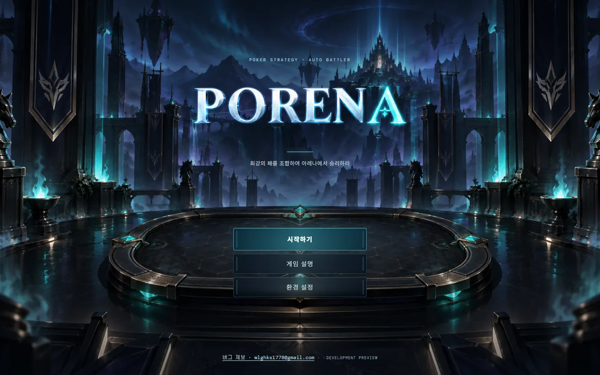
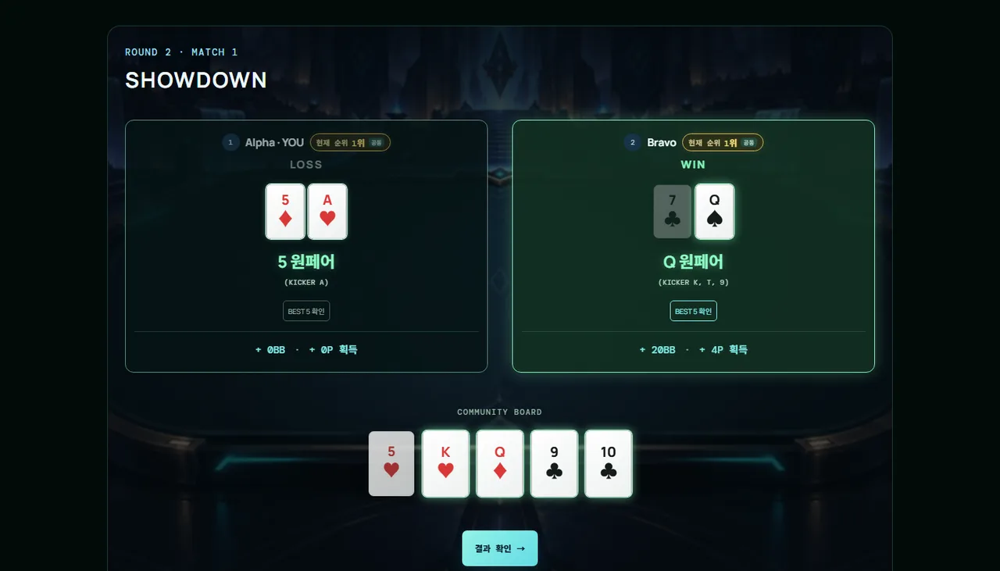
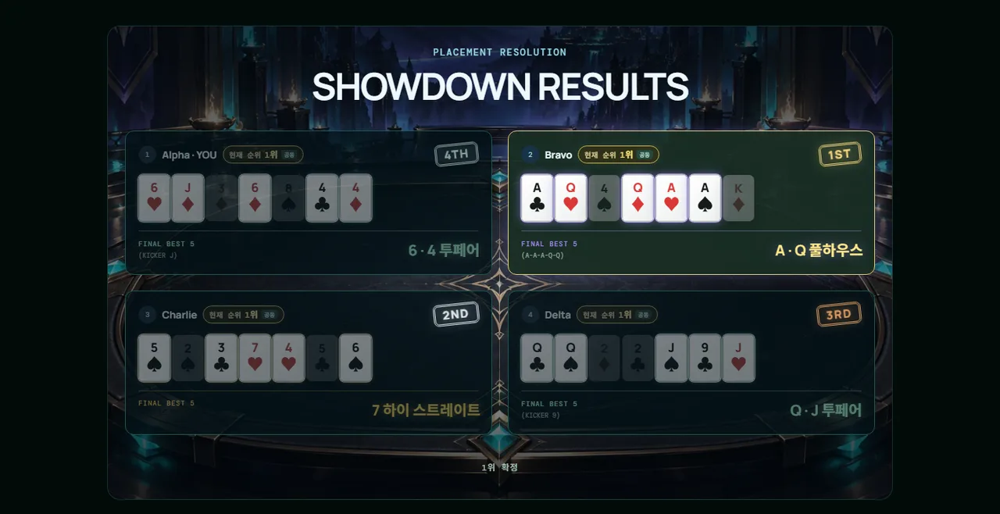

# PORENA

> **Tactical Poker Autobattler**



**패를 설계하고, 아레나를 지배하라.**

PORENA는 좋은 카드를 기다리는 포커가 아닙니다. 모든 플레이어가 **단 하나의 52장 카드 풀을 공유**하는 8인 전략 포커 게임입니다. 카드를 사고, 드래프트하고, 팔면서 자신의 패를 직접 설계하고, 라운드마다 달라지는 포커 규칙으로 경쟁합니다.

**[▶ 플레이하기](https://porena.kr)** · [GitHub](https://github.com/wlghks4689/holto-chess)

> **상태:** 온라인 플레이 가능한 개발 프로토타입
> **인원:** 실제 사용자 2~8명 · 빈 좌석은 AI가 채워 항상 8인으로 진행
> **서버:** Cloudflare Workers + Durable Objects + WebSocket

---

## Core Features

- 8인 전략 포커 게임
- 52장 고유 카드를 모두가 공유하는 소유 풀
- 라운드마다 완전히 달라지는 포커 룰 (홀덤 → 스플릿 런 → 오마하 → BEST 5 of 10 → 파이널)
- 카드 구매 / 판매 / 리롤 / 잠금 / 공개 드래프트
- 체력이 아닌 **누적 승점** 기반 생존 경쟁
- R2·R4 종료 후 증강 선택
- R5 Final Table Showdown 시네마틱

---

## Game Flow

```text
카드 확보 (상점 또는 드래프트)
        ↓
라운드 규칙에 맞춰 패 구성
        ↓
쇼다운 · BEST 5 판정
        ↓
승점(Point)과 BB 획득
        ↓
탈락 판정 → 증강 선택 → 다음 라운드
        ↓
Final Table · 최종 점수 합산
```

1. 라운드마다 상점에서 카드를 사거나, 공개 드래프트에서 한 장을 가져옵니다.
2. 보유 한도와 그 라운드의 출전 규칙에 맞게 패를 구성합니다.
3. 상대와 쇼다운을 진행하고 BEST 5로 승패를 가립니다.
4. 결과에 따라 승점과 BB를 얻습니다.
5. R3·R4에서는 누적 승점 하위 플레이어가 탈락합니다.
6. R5에서 누적 승점·족보 점수·남은 BB를 합산해 최종 순위를 정합니다.

---

## Round Structure

| Round | Mode | Hand | 구조 | 탈락 |
| --- | --- | ---: | --- | --- |
| **R1** | Hold'em Swiss | 2장 | 같은 패로 3경기 · 스위스 대진 | 없음 (8명) |
| **R2** | Open Draft + Split Run | 3장 | 공개 드래프트 → 앵커 1장 + 보조 2장으로 RUN 1 / RUN 2 | 없음 (8명) |
| **R3** | Omaha Swiss | 4장 | 3경기 · 정확히 홀 2 + 보드 3 | 누적 승점 하위 2명 (8 → 6) |
| **R4** | Best Five of Ten | 5장 | 공개 드래프트 → 상점 → 1차전 → 승자조 / 생존조 | 생존조 패자 2명 (6 → 4) |
| **R5** | Final Table | 7장 | 커뮤니티 보드 없이 7장 중 BEST 5 | 최종 순위 결정 |

**라운드 승점**

| Round | 승리 | 무승부(Split) | 기타 |
| --- | --- | --- | --- |
| R1 | +3P | +1P | — |
| R2 | RUN당 +4P | RUN당 +2P | 두 번의 RUN 합산 |
| R3 | +4P | +2P | 경기당 |
| R4 | 1차전 +6P | 1차전 각 +3P | 승자조 1위 +10P · 2위 +5P · 3위 +3P (공동 2위는 각 +3P) · 생존조 생존 +0P |
| R5 | 1위 +20P | — | 2위 +12P · 3위 +5P · 4위 +3P |

R4 승자조 타이브레이크는 우승자만 결정합니다. 최종 순위가 `1·2·2위`라면 `10·3·3P`를 지급하며, 일반 `1·2·3위`는 `10·5·3P`를 유지합니다.

**카드 부족 시 진행 우선 / 몰수패**

- 구매 제한시간이 끝나고 자동 구매를 시도해도 필수 카드 수를 채우지 못하면, 보유 카드를 그대로 유지하며 카드가 없는 상태도 쇼다운으로 진행합니다. 무료 카드·강제 보충·BB 부채는 만들지 않습니다.
- 카드가 부족한 플레이어는 해당 라운드의 매치/RUN에서 몰수패하며 승점·BB 보상을 받지 않습니다. 상대가 정상 핸드라면 상대가 승리합니다.
- 양쪽 모두 부족하면 공동 승리/Split 보상을 지급하지 않습니다. 진출자를 반드시 정해야 하는 브래킷·생존 판정에서 모두 부족한 경우에는 기존 하이카드 추첨으로 진출자만 정하며, 몰수패 보상은 여전히 0입니다.
- 다음 드래프트에는 부족한 카드 수 그대로 참가합니다. 구매 불가 타임아웃은 구매 없이 차례를 넘기며, R2의 3장을 채우지 못한 경우 두 RUN 모두 몰수패합니다. R5 카드 부족도 순위 보상과 핸드·증강 보너스 없이 정산합니다.

---

## Shared 52-Card Pool

PORENA의 모든 플레이어는 하나의 52장 카드 풀을 공유합니다. 같은 카드가 두 장 존재하지 않습니다.

카드 상태:

- `AVAILABLE` — 아무도 가지고 있지 않음
- `RESERVED_IN_SHOP` — 누군가의 상점에 노출되어 예약된 상태
- `OWNED` — 특정 플레이어가 소유

한 플레이어가 가진 카드는 다른 누구도 가질 수 없고, 탈락하거나 판매하면 다시 풀로 돌아옵니다. 그래서 **무엇을 사느냐뿐 아니라 무엇이 시장에서 사라졌는지 읽는 것**이 전략의 일부가 됩니다. 서버는 매 행동마다 풀의 무결성(총 52장, 중복 소유 없음)을 검증합니다.

**경제**

| 항목 | 값 |
| --- | --- |
| 시작 스택 | 50BB |
| 라운드 수입 | +30BB |
| 카드 가격 | 랭크별 20BB(A) ~ 5BB |
| 리롤 / 잠금 | 5BB / 3BB |
| 판매 환급 | 60% |
| 라운드별 구매 한도 | 2 / 2 / 2 / 3 / 3회 |
| 라운드별 리롤 한도 | 1 / 2 / 2 / 2 / 3회 |

---

## Open Draft

R2와 R4에서는 개인 상점 대신 공용 카드 드래프트를 진행합니다. R2는 8장, R4는 16장이 공개되고 각자 한 장씩 가져갑니다.

드래프트 순서:

1. 누적 승점이 **낮은** 플레이어 우선
2. 동점이면 BB가 **높은** 플레이어 우선

선택한 카드는 즉시 소유로 바뀌어 다른 플레이어가 고를 수 없습니다. 제한 시간이 지나면 AI가 대신 선택해 진행을 막지 않습니다.

**R2 Split Run** — 드래프트를 마치면 보유한 3장을 `앵커 1장 + 보조 2장`으로 배치합니다. RUN 1은 앵커+보조1, RUN 2는 앵커+보조2로 서로 다른 보드에서 진행되며, 두 RUN의 결과를 합산합니다.

**R4 브래킷 결정** — 6명이 1차전 3경기를 치릅니다. 정규 보드 승자는 +6P를 받고 승자조로 이동합니다. 정규 보드가 Split이면 두 플레이어 모두 +3P를 받되, 브래킷 배정을 위해 두 동률 플레이어만 새 보드로 계속 승부합니다. 최대 두 번의 Sudden Death 뒤에도 동률이면 서로 다른 랭크를 서버가 추첨해 높은 랭크 한 명을 승자조로 보냅니다. 이 결정전에는 추가 승점이 없습니다. 승자조 3명은 최종 순위에 따라 +10P / +5P / +3P를 받고, 생존조 3명 중 한 명만 생존하며 생존 승점은 +0P입니다.

### Synchronized phase timeline

아래 시간은 서버가 관리하는 최대 대기시간입니다. 모든 필요한 플레이어가 먼저 확인하면 일부 단계는 조기 진행되며, 쇼다운 시네마틱은 매치 수와 타이브레이크 발생 여부에 따라 별도 재생됩니다.

| 단계 | 제한 시간 | 동작 |
| --- | ---: | --- |
| 상점 | 60초 | 미완료 좌석은 시간이 끝나면 자동 준비 |
| Draft Order · Deal-In | 3초 | 모든 좌석이 같은 카드 배치 연출을 본 뒤 선택 시작 |
| 공개 드래프트 선택 | 플레이어당 20초 | AI 선택은 1.8초 간격 · 시간 초과 시 자동 선택 |
| R2 RUN 카드 배치 | 30초 | 미완성 배치는 자동 완성 후 확정 |
| VS · 전장 준비 | 3초 | 상대와 전장을 동기화한 뒤 쇼다운 시네마틱 시작 |
| R4 브래킷 확인 | 10초 | 승자조와 생존조 구성을 확인 |
| 라운드 결과 | 30초 | 결과 확인 후 다음 단계로 이동 |
| 증강 선택 · 다음 라운드 · 생존 타이브레이크 준비 | 30초 | 미응답 좌석은 서버가 자동 처리 |
| 쇼다운 시네마틱 | 가변 | 카드 공개·BEST 5·결과·보상 연출, 매치 사이 1.5초 유지 |

R4의 실제 순서는 `Draft Order 3초 → 순차 드래프트(각 20초, AI 1.8초) → 상점 60초 → 1차전 준비 3초 → 1차전 시네마틱 → 브래킷 확인 10초 → 2차전 준비 3초 → 승자조·생존조 시네마틱 → 결과 30초 → 증강 선택`입니다.

---

## Scoring

PORENA는 체력제가 아니라 **누적 승점제**입니다. 라운드에서 쌓은 성과가 그대로 남아 탈락 판정과 최종 순위에 쓰입니다.

```text
Final Score = 누적 Point
            + Hand Score (R5 최종 족보 점수)
            + floor(남은 BB / 10)
```

- 족보 점수: 원페어 1 · 투페어 2 · 트립스 5 · 스트레이트 8 · 플러시 12 · 풀하우스 15 · 포카드 20 · 스트레이트 플러시 30 · 로열 플러시 40
- 최종 순위 보상: 1위 +8 · 2위 +4 · 3위 +2 · 4위 0 · 5위 -1 · 6위 -2 · 7위 -4 · 8위 -8
- 탈락한 플레이어는 탈락 시점의 승점·스택·족보가 기록되어 최종 순위에 반영됩니다.

---

## Screenshots

**Showdown** — 라운드마다 다른 아레나 배경 위에서 카드가 뒤집히고 BEST 5가 빛납니다.



**Final Table** — 4인 최종전. 7장을 3 → 2 → 2로 공개하고 순위 도장이 찍힙니다.



---

## Tech Stack

- React + TypeScript + Vite
- Cloudflare Workers · Durable Objects · WebSocket
- Vitest (`@cloudflare/vitest-pool-workers` 포함) · ESLint

```text
Browser (React UI)
      ↓  WebSocket
Cloudflare Worker
      ↓
Durable Object (방 1개 = 인스턴스 1개, SQLite 스토리지)
```

---

## Multiplayer Architecture

서버가 authoritative state를 가집니다. 클라이언트는 행동을 요청하고 받은 `PlayerView`를 그릴 뿐입니다.

| Client | Server |
| --- | --- |
| 액션 요청 (구매 / 드래프트 / 준비) | 카드 소유권과 풀 무결성 |
| PlayerView 렌더링 | 보드 생성 · 쇼다운 판정 · BEST 5 |
| 연출 재생 | 승점 / BB / 탈락 / 최종 순위 |

- **비공개 정보 차단:** 상대의 홀카드와 상점은 payload에 포함하지 않습니다. 쇼다운으로 공개된 카드만 내려갑니다.
- **재접속:** 세션 토큰으로 같은 좌석에 복귀하며, 진행 중인 연출은 현재 시점부터 이어집니다.
- **진행 보장:** 단계별 제한시간과 자동 진행은 위 타임라인을 따릅니다. 시간이 지나면 서버가 미완료 좌석을 대신 처리해 한 명이 방을 멈출 수 없습니다.
- **연출 동기화:** 서버가 쇼다운 연출의 시작·종료 시각을 정해 모든 좌석이 같은 순간에 같은 장면을 보고 함께 결과 화면으로 넘어갑니다.
- **관전과 재대결:** 탈락한 플레이어는 관전할 수 있고, 게임이 끝나면 같은 방에서 재대결할 수 있습니다.

---

## Project Structure

```text
holto-chess/
├─ src/
│  ├─ core/     # 카드와 포커 평가기 (족보 · BEST 5)
│  ├─ game/     # 게임 규칙, 방 상태, 밸런스 수치, 봇
│  ├─ shared/   # 클라이언트·서버 공용 프로토콜과 연출 타임라인
│  └─ ui/       # React 화면과 쇼다운 시네마틱
├─ worker/      # Cloudflare Worker + Durable Object
├─ tools/       # 밸런스 시뮬레이터, 운영 스크립트
└─ public/      # 배경 아트 등 정적 에셋
```

---

## Run Locally

```bash
npm install
npm run dev
```

빌드 · 테스트 · 배포:

```bash
npm run build
npm test
npm run test:workers
npm run deploy
```

저장소 루트의 명령은 모두 `holto-chess/`로 위임됩니다.

---

## Development Status

### Implemented
- [x] R1~R5 게임 루프
- [x] 52장 공유 카드 풀
- [x] 멀티플레이 방 · 초대 링크 · 재접속
- [x] Open Draft (R2 · R4)
- [x] Omaha Swiss (R3)
- [x] 쇼다운 시네마틱 · 서버 기준 연출 동기화
- [x] Final Table Showdown
- [x] 증강 시스템
- [x] 탈락자 관전 · 재대결

### In Progress
- [ ] 밸런스 조정
- [ ] AI 전략 개선
- [ ] 사운드 / BGM
- [ ] 랭킹 · 계정 시스템 (미구현)
- [ ] Steam 빌드

---

## Design Philosophy

PORENA는 텍사스 홀덤을 그대로 복제하지 않습니다.

- 운보다 **선택**의 비중을 높입니다.
- 카드 자체를 사고파는 **전략 자원**으로 만듭니다.
- 라운드마다 다른 포커 규칙을 제공해 한 가지 최적해가 굳어지지 않게 합니다.
- 포커와 오토배틀러 사이의 새로운 게임 경험을 목표로 합니다.

---

## Roadmap

- 밸런스 시뮬레이션 기반 수치 조정
- AI 전략 고도화
- 사운드 디자인
- 계정 · 랭킹 시스템
- 증강 추가
- Steam 빌드

---

## License

현재 프로토타입 단계의 비공개 프로젝트입니다. 별도 라이선스가 부여되기 전까지 모든 권리는 제작자에게 있습니다.

버그 제보: wlghks1778@gmail.com
