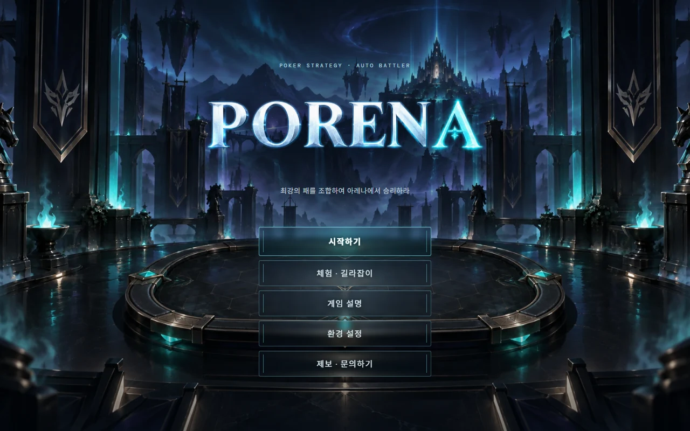
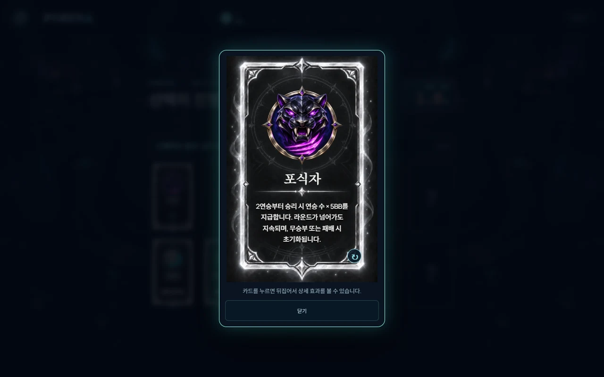
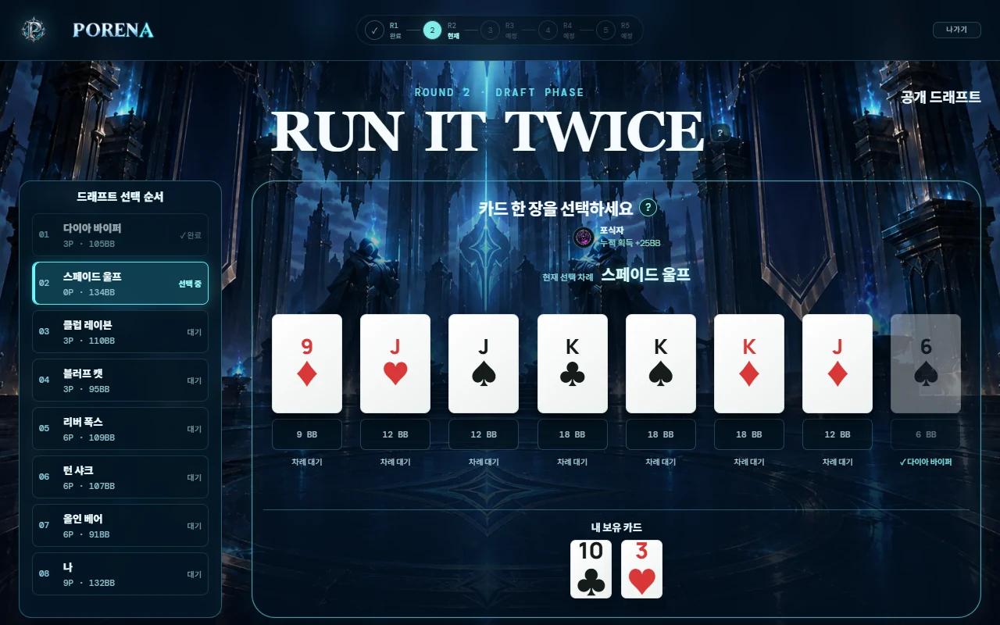
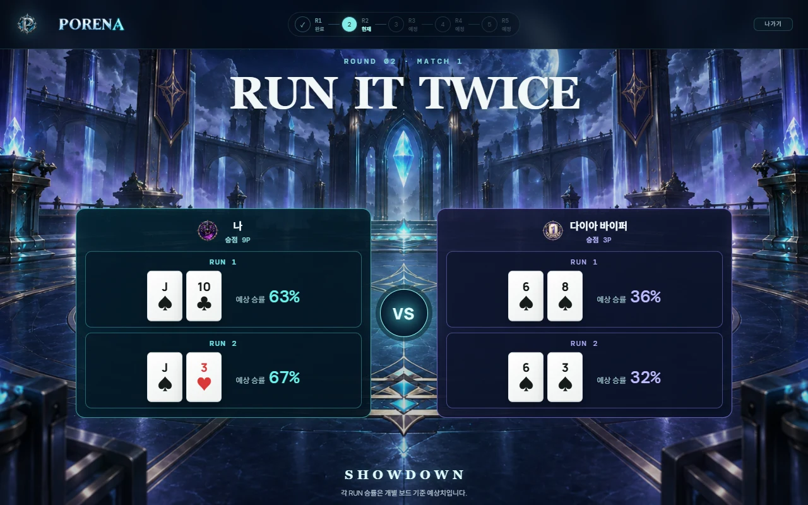
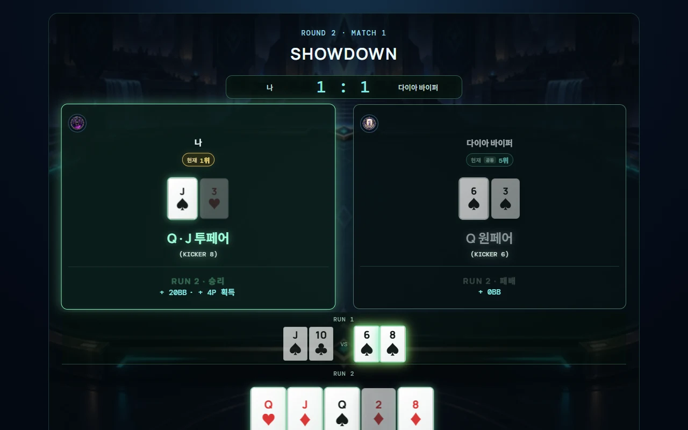
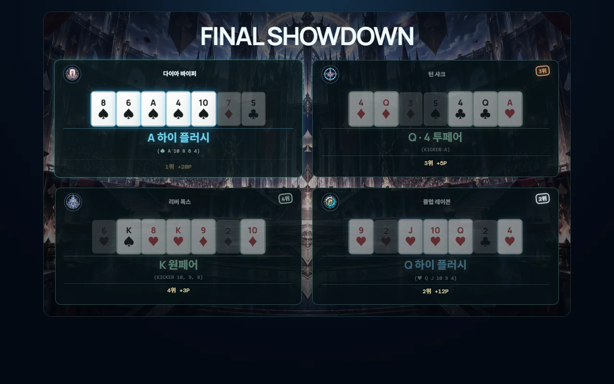
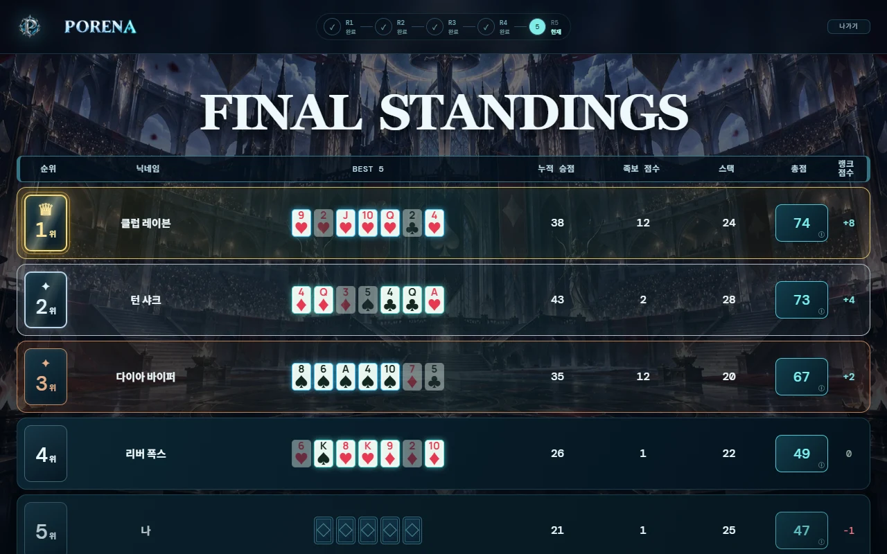

# PORENA

> **Tactical Poker Autobattler**



**패를 설계하고, 아레나를 지배하라.**

PORENA는 좋은 카드를 기다리는 포커가 아닙니다. 8명이 **하나의 52장 카드 풀**을 나눠 쓰며, 필요한 카드를 사고·팔고·드래프트해서 자신의 패를 직접 설계하는 전략 포커 게임입니다. 라운드마다 포커 규칙이 바뀌고, 5라운드 동안 모은 승점으로 우승을 가립니다.

**[▶ 플레이하기](https://porena.kr)** · [GitHub](https://github.com/wlghks4689/holto-chess)

> **상태:** 온라인 플레이 가능한 개발 프로토타입
> **인원:** 실제 사용자 2~8명 · 빈 좌석은 AI가 채워 항상 8인으로 진행
> **서버:** Cloudflare Workers + Durable Objects + WebSocket
> **언어:** 한국어 · English (브라우저 언어로 자동 선택, 환경 설정에서 변경)

게임 안의 **게임 설명**은 두 갈래로 나뉩니다. 포커가 처음이라면 *초보자 가이드*, 규칙과 수치를 바로 찾고 싶다면 *규칙서*를 여세요. 아래 README도 같은 순서입니다.

---

## 처음이라면 — 5분 요약

1. **어빌리티를 고릅니다.** 게임 시작 전 뒷면 카드 12장 중 1장을 골라 나만의 능력을 얻습니다.
2. **카드를 모읍니다.** 상점에서 BB로 카드를 사거나, 공개 드래프트에서 한 장을 가져옵니다. 누군가 가진 카드는 다른 사람이 가질 수 없습니다.
3. **라운드 규칙에 맞춰 싸웁니다.** 가장 좋은 5장(BEST 5)의 포커 족보로 승패를 가립니다.
4. **승점과 BB를 받습니다.** R3와 R4에서는 누적 승점 하위 플레이어가 2명씩 탈락합니다.
5. **R5 결승 후 최종 점수로 우승을 정합니다.**

```text
R1 8명 ─ R2 8명 ─ R3 6명 ─ R4 4명 ─ R5 최종 순위
                    ▲ 2명 탈락   ▲ 2명 탈락
```

| 라운드 | 한 줄 설명 |
| --- | --- |
| **R1 CLASSIC HOLD'EM** | 내 카드 2장 + 보드 5장. 익숙한 홀덤으로 3경기 |
| **R2 RUN IT TWICE** | 드래프트로 3장을 만들고, 중심 카드 1장을 두 판에 모두 사용 |
| **R3 OMAHA SWISS** | 4장을 갖지만 반드시 내 카드 2장 + 보드 3장. 탈락 시작 |
| **R4 BEST FIVE OF TEN** | 내 카드 5장 + 보드 5장. 승자조 / 생존조로 나뉨 |
| **R5 THE LAST HAND** | 보드 없이 내 카드 7장 중 BEST 5. 남은 4명의 결승 |

```text
최종 점수 = 누적 승점 + R5 족보 점수 + ⌊남은 BB ÷ 10⌋
```

어빌리티로 받은 승점·BB는 따로 더하지 않고 위 식에 이미 들어 있습니다.

---

## 규칙서

모든 수치는 게임 코드(`holto-chess/src/game/config.ts`, `engine.ts`, `abilities.ts`)가 기준이며, 게임 안 규칙서도 같은 값을 코드에서 직접 읽어 표시합니다.

### 1. 기본 규칙

| 항목 | 값 |
| --- | --- |
| 플레이어 | 8명 · 빈 좌석은 AI |
| 카드 풀 | 고유 카드 52장 공유 |
| 시작 | 50BB · 시작 카드 1장 · 어빌리티 1개 |
| 라운드 수입 | R2~R5 시작 시 생존자 +30BB |
| 상점 카드 | 2장 |
| 리롤 / 잠금 | 5BB / 3BB |
| 판매 환급 | 기본 가격의 60% (소수점 버림) |
| 제한 시간 | 상점 60초 · 드래프트 1픽 20초 · R2 배치 30초 |

| 라운드 | R1 | R2 | R3 | R4 | R5 |
| --- | ---: | ---: | ---: | ---: | ---: |
| 보유 장수 | 2 | 3 | 4 | 5 | 7 |
| 구매 한도 | 2 | 상점 없음 | 2 | 3 | 3 |
| 리롤 한도 | 1 | — | 2 | 2 | 3 |

**카드 가격 (BB)** — A 20 · K 18 · Q 15 · J 12 · T 10 · 9~2는 숫자와 같음 (9BB ~ 2BB)

### 2. 공유 카드 풀

- 52장은 모두 한 장씩만 존재합니다. 누군가 보유한 카드는 다른 플레이어의 상점·드래프트에 나오지 않습니다.
- 내 상점에 놓인 카드도 그동안 다른 플레이어에게 나오지 않습니다.
- 판매한 카드와 탈락한 플레이어의 카드는 풀로 돌아갑니다.
- 상대 카드는 쇼다운에서 공개되기 전까지 보이지 않습니다. 보드 카드는 그 경기 참가자의 보유 카드와 겹치지 않습니다.

### 3. 경제 (정규 경기 BB 보상)

| 경기 | 승리 | 패배 |
| --- | --- | --- |
| R1 | +10 | +15 (+5 × 연패) |
| R2 RUN · R4 1차전 · R4 승자조 | +20 (+5 × 연승) | +10 × 연패 |
| R3 | +10 | +15 (+5 × 연패) |
| R4 생존조 · R5 | — | — |

연승·연패는 이번 경기 전까지 이어진 횟수입니다. 카드가 부족해 몰수패하면 승점과 BB를 받지 않습니다.

### 4. 라운드

| 라운드 | 인원 | 카드 | 경기 | 승점 | 규칙 | 탈락 |
| --- | ---: | ---: | --- | --- | --- | --- |
| **R1** Hold'em Swiss | 8 | 2 | 1:1 스위스 ×3 | 승 +3P · Split +1P | 홀 2 + 보드 5 중 BEST 5 | 없음 |
| **R2** Run It Twice | 8 | 3 | 드래프트 → 1:1 RUN ×2 | RUN당 승 +4P · Split +2P | 앵커 1 + 보조 1 + 보드 5 | 없음 |
| **R3** Omaha Swiss | 8 | 4 | 1:1 스위스 ×3 | 승 +4P · Split +2P | 홀 정확히 2 + 보드 정확히 3 | 누적 승점 하위 2명 |
| **R4** Best Five of Ten | 6 | 5 | 드래프트 → 상점 → 1차전 → 3인 그룹 | 1차전 승 +6P · Split +3P | 홀 5 + 보드 5 중 BEST 5 | 생존조 2명 |
| **R5** The Last Hand | 4 | 7 | 4인 동시 | +20 / +12 / +5 / +3P | 보유 7장 중 BEST 5 | 최종 순위 |

- **R2** — 개인 상점이 없습니다. 3장을 `앵커 1 + 보조 2`로 배치하면 RUN 1은 앵커+보조1, RUN 2는 앵커+보조2로 서로 다른 보드에서 진행됩니다.
- **R3** — 1경기 대진은 누적 승점(동점이면 BB) 순서로 정해지고, 2·3경기는 전적이 비슷한 상대와 붙습니다.
- **R4** — 1차전 승자 3명은 승자조(1위 +10P · 2위 +5P · 3위 +3P, 공동 2위는 각 +3P), 패자 3명은 생존조(1위만 생존, +0P)로 갑니다.
- **R5** — 커뮤니티 보드가 없습니다. 공동 순위는 해당 순위들의 승점을 합쳐 남은 BB 비율로 나눕니다(ICM).

### 5. 공개 드래프트 (R2 · R4)

R2는 8장, R4는 16장이 공개되고 한 사람당 1장씩 가격만큼 BB를 내고 가져갑니다. 살 수 있는 카드가 없으면 건너뜁니다.

선택 순서:

1. **퍼스트 클래스** 어빌리티 보유자
2. 누적 승점이 **낮은** 플레이어
3. 승점이 같으면 BB가 **많은** 플레이어
4. 그래도 같으면 무작위

### 6. 탈락

- **R3**: 3경기 후 누적 승점 하위 2명 탈락. 탈락선에 동점자가 걸리면 새 보드로 **생존 타이브레이크**를 합니다(승점·BB 없음, BB는 동점을 가르지 않음). 보드 3번이 모두 동률이면 무작위 랭크 추첨.
- **R4**: 생존조 3명 중 1위 1명만 남고 2명 탈락.
- 탈락하면 보유 카드는 풀로 돌아가고, 탈락 당시 승점으로 순위가 고정됩니다.

### 7. 최종 점수와 순위

```text
Final Score = 누적 Point + R5 Hand Score + floor(남은 BB / 10)
```

| 족보 | 하이카드 | 원페어 | 투페어 | 트립스 | 스트레이트 | 플러시 | 풀하우스 | 포카드 | 스트레이트 플러시 | 로열 플러시 |
| --- | ---: | ---: | ---: | ---: | ---: | ---: | ---: | ---: | ---: | ---: |
| 점수 | 0 | 1 | 2 | 5 | 8 | 12 | 15 | 20 | 35 | 50 |

- R5 진출자 4명은 최종 점수로 1~4위를 정합니다. 점수가 같으면 R5 결승 순위가 높은 쪽이 앞섭니다.
- R4 탈락자는 5~6위, R3 탈락자는 7~8위이며 탈락 당시 승점 순입니다. BB와 족보는 이 순위대를 바꾸지 않습니다.
- 결과 화면의 **랭크 점수**(+8 / +4 / +2 / 0 / −1 / −2 / −4 / −8)는 1~8위 표시용이며 최종 점수에 더해지지 않습니다.

### 8. 어빌리티

게임 시작 전 순서대로 뒷면 카드 12장 중 1장을 고르고, 8명이 서로 다른 어빌리티를 받습니다. 시간이 지나면 남은 카드 중 하나가 자동 선택됩니다. 매치 보상형 어빌리티는 **정규 경기**에서만 발동하며 타이브레이크 보드는 보상을 만들지 않습니다.

| 어빌리티 | 효과 | 발동 시점 · 주의 |
| --- | --- | --- |
| **왕가의 혈통** | 시작 카드를 A·K·Q·J·T 중에서 받고, 이 랭크를 상점·드래프트에서 50% 가격(버림)에 구매 | 예: Q 15BB → 7BB |
| **타겟 스나이퍼** | 처음 받은 카드가 BEST 5에 들어간 채로 정규 경기에서 단독 승리하면 +15BB | 족보 조건 없음 · Split 및 Split 뒤 타이브레이크 승리 제외 · R2는 RUN마다 · 시작 카드를 팔면 꺼지고 다시 사면 켜짐 |
| **언더독** | R5에서 2가 포함된 BEST 5로 스트레이트 이상이면 +20P | R1~R4에서는 발동하지 않음 |
| **퍼스트 클래스** | R2·R4 공개 드래프트에서 항상 첫 번째로 선택 | 나머지 순서는 기존 규칙 |
| **황금의 손** | 개인 상점 카드 +1장, 판매 시 기본 가격 100% 환급 | R2에는 개인 상점이 없음 · 시작 카드도 100% |
| **트레이더** | 개인 상점 리롤·잠금 무료, 상점 단계마다 리롤 +1회 | R2 미적용 |
| **포식자** | 정규 경기 단독 승리로 연승 +1, 2연승부터 승리마다 연승 수 × 5BB (2연승 10 · 3연승 15 · 4연승 20 …) | 연승은 라운드를 넘어 유지 · Split/패배 시 초기화 · 타이브레이크 승리 제외 |
| **건축가** | 정규 경기 최종 족보가 정확히 풀하우스이면 +30BB | 승패 무관 · R2는 RUN마다 · 포카드 이상 제외 |
| **자본주의** | 살아남은 라운드 종료 시 보유 BB의 15%(버림) 지급 | 라운드당 1회 · 탈락 라운드 제외 · R5 후에도 지급 |
| **쿼드 코어** | R5 결승에서 포카드를 만들면 R5 순위 승점 2배 | 어떤 카드로 만든 포카드든 인정(보드 완성 포함) · 순위 승점만 2배 · R1~R4 포카드 제외 |
| **독주자** | 라운드 종료 시 1위라면 추가 승점 R1 +3 · R2 +4 · R3 +5 · R4 +6 · R5 +7P | R1~R4는 생존자 순위표(승점 → BB → 좌석) 1명만 · R5는 결승 1위 기준, 공동 1위 모두 지급 |
| **프로텍터** | R1~R4 1:1 정규 경기에서 경기 전 예상 승률 60% 이상인데 패배하면 승률 구간별 BB: 60% 이상 +20 · 70% 이상 +30 · 80% 이상 +50 | 예상 승률은 경기 화면 표시값(버림) · Split/R5/타이브레이크 제외 |

### 9. 동률 · 예외

- 족보가 같으면 키커까지 비교합니다. 무늬로는 승패를 가리지 않으며, 완전히 같으면 Split입니다.
- R4 1차전이 Split이면 두 명 모두 +3P, 조 배정만 새 보드로 가립니다(최대 2번, 이후 무작위 랭크 추첨). 이 결정전에는 추가 승점이 없습니다.
- R4 승자조 동률은 1위만 새 보드로 가립니다. 공동 2위는 각 +3P입니다.
- 필요한 카드 수를 채우지 못하면 그 경기는 몰수패(승점·BB 없음)입니다. 무료 카드·강제 보충·BB 부채는 만들지 않으며, 부족한 장수 그대로 다음 드래프트에 참가합니다. 두 명 모두 부족하면 공동 보상도 없고, 진출자를 반드시 정해야 하는 브래킷·생존 판정에서만 하이카드 추첨으로 진출자를 정합니다.
- 제한 시간이 끝나면 미완료 행동은 서버가 자동으로 처리해 게임이 멈추지 않습니다.


### 10. 진행 시간 (서버 동기화)

아래 시간은 서버가 관리하는 최대 대기시간입니다. 모든 필요한 플레이어가 먼저 확인하면 일부 단계는 조기 진행되며, 쇼다운 시네마틱은 매치 수와 타이브레이크 발생 여부에 따라 별도 재생됩니다.

| 단계 | 제한 시간 | 동작 |
| --- | ---: | --- |
| 어빌리티 선택 순서 공개 | 3초 | 주사위로 선택 순서를 정해 모든 좌석에 공개 |
| 어빌리티 선택 | 플레이어당 12초 | 시간 초과 시 남은 카드 중 하나를 자동 선택 |
| 어빌리티 공개 확인 | 30초 | 모두 준비하면 바로 상점으로 이동 |
| 상점 | 60초 | 미완료 좌석은 시간이 끝나면 자동 준비 |
| Draft Order · Deal-In | 3초 | 모든 좌석이 같은 카드 배치 연출을 본 뒤 선택 시작 |
| 공개 드래프트 선택 | 플레이어당 20초 | AI 선택은 1.8초 간격 · 시간 초과 시 자동 선택 |
| 드래프트 결과 공개 | 3.5초 | 마지막 선택 뒤 모든 픽을 보여주고 다음 단계로 |
| R2 RUN 카드 배치 | 30초 | 미완성 배치는 자동 완성 후 확정 |
| 쇼다운 매치업 동기화 | 3.5초 | 플레이어 구도와 예상 승률을 표시하며 상대와 화면을 동기화한 뒤 자동 시작 |
| R4 브래킷 확인 | 10초 | 승자조와 생존조 구성을 확인 |
| 라운드 결과 | 30초 | 결과 확인 후 다음 단계로 이동 |
| 다음 라운드 · 생존 타이브레이크 준비 | 30초 | 미응답 좌석은 서버가 자동 처리 |
| 쇼다운 시네마틱 | 가변 | 카드 공개·BEST 5·결과·보상 연출. 매치 사이에는 결과를 3초 보여준 뒤 다음 매치업(3.5초)으로 이동 |

R4의 실제 순서는 `Draft Order 3초 → 순차 드래프트(각 20초, AI 1.8초) → 드래프트 결과 3.5초 → 상점 60초 → 1차전 준비 3.5초 → 1차전 시네마틱 → 브래킷 확인 10초 → 2차전 준비 3.5초 → 승자조·생존조 시네마틱 → 결과 30초 → 다음 라운드`입니다.

---

## Screenshots

**Ability Draft** — 게임 시작 전 뒷면 카드 12장 중 1장을 골라 나만의 어빌리티를 받습니다. 카드를 누르면 뒤집혀 상세 규칙이 보입니다.



**Open Draft** — 공개된 카드를 승점 낮은 순서대로 한 장씩 가져갑니다. 이미 누가 가져간 카드인지 모두에게 보입니다.



**Run It Twice** — 쇼다운 직전, 두 RUN의 카드 구성과 RUN별 예상 승률을 보여줍니다.



**Showdown** — 보드가 한 장씩 열리고 BEST 5가 빛나며, RUN마다 승점과 BB가 정산됩니다.



**Final Showdown** — 커뮤니티 보드 없이 남은 4명이 7장 중 BEST 5로 마지막 순위를 가립니다.



**Final Standings** — 누적 승점 + 족보 점수 + 스택 점수로 1~8위를 확정합니다.



---

## Tech Stack

- React + TypeScript + Vite
- Cloudflare Workers · Durable Objects · WebSocket
- Vitest (`@cloudflare/vitest-pool-workers` 포함) · ESLint

```text
Browser (React UI)
      ↓  WebSocket
Cloudflare Worker
      ↓
Durable Object (방 1개 = 인스턴스 1개, SQLite 스토리지)
```

---

## Multiplayer Architecture

서버가 authoritative state를 가집니다. 클라이언트는 행동을 요청하고 받은 `PlayerView`를 그릴 뿐입니다.

| Client | Server |
| --- | --- |
| 액션 요청 (구매 / 드래프트 / 준비) | 카드 소유권과 풀 무결성 |
| PlayerView 렌더링 | 보드 생성 · 쇼다운 판정 · BEST 5 |
| 연출 재생 | 승점 / BB / 탈락 / 최종 순위 |

- **비공개 정보 차단:** 상대의 홀카드와 상점은 payload에 포함하지 않습니다. 쇼다운으로 공개된 카드만 내려갑니다.
- **재접속:** 세션 토큰으로 같은 좌석에 복귀하며, 진행 중인 연출은 현재 시점부터 이어집니다.
- **진행 보장:** 단계별 제한시간과 자동 진행은 위 타임라인을 따릅니다. 시간이 지나면 서버가 미완료 좌석을 대신 처리해 한 명이 방을 멈출 수 없습니다.
- **연출 동기화:** 서버가 쇼다운 연출의 시작·종료 시각을 정해 모든 좌석이 같은 순간에 같은 장면을 보고 함께 결과 화면으로 넘어갑니다.
- **관전과 재대결:** 탈락한 플레이어는 관전할 수 있고, 게임이 끝나면 같은 방에서 재대결할 수 있습니다.

---

## Project Structure

```text
holto-chess/
├─ src/
│  ├─ core/     # 카드와 포커 평가기 (족보 · BEST 5)
│  ├─ game/     # 게임 규칙, 방 상태, 밸런스 수치, 봇
│  ├─ shared/   # 클라이언트·서버 공용 프로토콜과 연출 타임라인
│  ├─ i18n/     # 한국어 · 영어 문구
│  ├─ tutorial/ # 체험 · 길라잡이 5장
│  ├─ admin/    # 제보 · 문의 관리자 수신함
│  └─ ui/       # React 화면, 쇼다운 시네마틱, 게임 설명
├─ worker/      # Cloudflare Worker + Durable Object
├─ tools/       # 밸런스 시뮬레이터, 운영 스크립트
└─ public/      # 배경 아트 등 정적 에셋
```

---

## Run Locally

```bash
npm install
npm run dev
```

빌드 · 테스트 · 배포:

```bash
npm run build
npm test
npm run test:workers
npm run deploy
```

저장소 루트의 명령은 모두 `holto-chess/`로 위임됩니다. 앱 구조와 개발 원칙은 [holto-chess/README.md](holto-chess/README.md)에 있습니다.

### 밸런스 시뮬레이터

규칙을 다시 구현하지 않고 실제 게임 엔진으로 8인 게임을 끝까지 반복 실행해, 정책·좌석·드래프트 순번·카드·경제·점수 구성·어빌리티별 결과를 신뢰구간과 함께 집계합니다.

```bash
cd holto-chess
node tools/balance-simulator/run.mjs --games 200 --jobs 4                      # 현행 규칙
node tools/balance-simulator/run.mjs --games 200 --set rankPrices.14=15 --compare # 수치 변경 전후 비교
node tools/balance-simulator/run.mjs --games 2000 --abilities --policies ABILITY_AWARE --rows --jobs 8
```

자세한 옵션은 [tools/balance-simulator/README.md](holto-chess/tools/balance-simulator/README.md)를 보세요.

---

## Development Status

### Implemented
- [x] R1~R5 게임 루프
- [x] 52장 공유 카드 풀
- [x] 멀티플레이 방 · 초대 링크 · 재접속
- [x] Open Draft (R2 · R4)
- [x] Omaha Swiss (R3)
- [x] 쇼다운 시네마틱 · 서버 기준 연출 동기화
- [x] Final Table Showdown
- [x] 탈락자 관전 · 재대결
- [x] 어빌리티 12종 · 게임 시작 전 어빌리티 드래프트
- [x] 게임 설명: 초보자 가이드 / 규칙서 분리
- [x] 체험 · 길라잡이 (5장, 라운드별 연습)
- [x] 한국어 · 영어 지원
- [x] 메이드 족보 효과음 · 음량 설정
- [x] 쇼다운 전 예상 승률 표시
- [x] 제보 · 문의 양식과 관리자 수신함
- [x] 멀티플레이 대전 기록을 기기에 저장 (최근 20경기)
- [x] 실제 엔진 기반 밸런스 시뮬레이터 · 어빌리티별 승률 측정

### In Progress
- [ ] 밸런스 조정
- [ ] AI 전략 개선
- [ ] BGM
- [ ] 랭킹 · 계정 시스템 (미구현)
- [ ] Steam 빌드

---

## Design Philosophy

PORENA는 텍사스 홀덤을 그대로 복제하지 않습니다.

- 운보다 **선택**의 비중을 높입니다.
- 카드 자체를 사고파는 **전략 자원**으로 만듭니다.
- 라운드마다 다른 포커 규칙을 제공해 한 가지 최적해가 굳어지지 않게 합니다.
- 포커와 오토배틀러 사이의 새로운 게임 경험을 목표로 합니다.

---

## Roadmap

- 밸런스 시뮬레이션 기반 수치 조정
- AI 전략 고도화
- BGM · 사운드 디자인 확장
- 계정 · 랭킹 시스템
- Steam 빌드

---

## License

현재 프로토타입 단계의 비공개 프로젝트입니다. 별도 라이선스가 부여되기 전까지 모든 권리는 제작자에게 있습니다.

버그 제보 · 피드백 · 문의: 게임 시작 화면의 **제보 · 문의하기**
