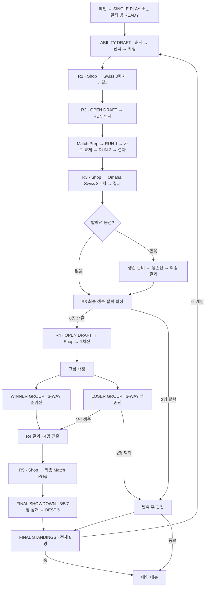

# PORENA 게임·서비스 IA — AS-IS

기준일: 2026-10-03 · 기준: `main` / `38e78364417011876fab4fc46c700bd97ce426b9` · 신규 게임: `rulesVersion = 2`

원격 `origin/main`을 fetch해 같은 HEAD임을 확인했다. 화면명은 한국어 UI와 실제 영어 타이틀을 따른다. 게임 화면은 대부분 `/` 안에서 상태로 교체되며, URL 페이지·게임 페이즈·연출 상태를 구분한다. PC/Mobile은 동일 화면의 레이아웃 variant다.

## 1. 서비스 전체 구조

```text
PORENA
├─ 메인 메뉴 [L-01]
│  ├─ 시작하기 → 플레이 방식 선택 [O-01]
│  ├─ 체험 · 길라잡이 [T-01~03]
│  └─ 게임 설명 / 환경 설정 / 제보 · 문의하기 [O-02~04]
├─ 게임 진입
│  ├─ SINGLE PLAY → 나 + AI 7명 → ABILITY [A-01]
│  └─ MULTIPLAYER → 로비 / 대기실 / 재접속 / 대전 기록 [E-01~04]
├─ 게임
│  ├─ ABILITY DRAFT [A-01~03]
│  ├─ R1~R5 준비 · 매치 · 결과 [R1~R5]
│  └─ 탈락 후 관전 / 연결 복구 (같은 게임 화면의 기능 상태)
├─ 정책 페이지
│  ├─ 개인정보처리방침 /privacy [S-01]
│  └─ 이용약관 /terms [S-02]
└─ 운영자 영역 (플레이어 메뉴와 분리)
   ├─ 관리자 로그인 [S-03]
   └─ 제보·문의 수신함 / 보관함 / 메시지 상세 [S-04]
```

| 영역 | 실제 진입·관계 |
| --- | --- |
| 메인·게임·체험 | `ModeApp`의 `single` / `multi` / `tutorial` 모드 전환. 별도 게임 URL로 이동하지 않는다. |
| 멀티 진입 | 방 만들기 또는 6자리 코드 참가. `?room=…` 초대 링크는 멀티 로비의 참가 폼으로 연결한다. 최근 참가 방에서 좌석 재접속 가능. |
| 체험 | 기본 R1 체험과 선택 R2~R5 연습. 완료 후 싱글 시작 / 다음 연습 / 장 선택 / 홈. 게임 설명 팝업과 별도 기능이다. |
| 정책 | 게임 시작 없이 접근. 두 문서 간 이동, 한국어/English 변경, 홈 이동. |
| 운영자 | 코드상 `admin.porena.kr`, 로컬 `/admin`. 로그인 후 문의 처리. 운영 배포·계정 설정 여부는 이 IA에서 검증하지 않았다. |

## 2. Core Game IA

```text
Game Start (8명)
└─ ABILITY DRAFT
   ├─ 선택 순서 공개
   ├─ 뒷면 카드 선택 (내 차례 / 다른 플레이어 차례)
   └─ 어빌리티 카드 확정 → R1

R1 · TWO HAND (8명 → 8명)
├─ Shop: 내 카드 2장 구성
├─ Match Prep → SHOWDOWN: 1:1 Swiss MATCH 1~3
│  └─ 매치 사이 다음 상대 Match Prep (같은 라운드·핸드 유지)
└─ 라운드 결과 / 순위표 → R2

R2 · RUN IT TWICE (8명 → 8명)
├─ Draft Order → OPEN DRAFT: 공개 8장 중 각자 1장 구매
├─ RUN 카드 배치: 대표 카드 + RUN 1 보조 + RUN 2 보조
├─ Match Prep: 두 RUN의 핸드·예상 승률
├─ SHOWDOWN: 같은 상대와 RUN 1 → RUN 2
│  ├─ RUN 1: 대표 + 보조 1 / 첫 보드
│  └─ RUN 2: 보조 카드 교체 → 두 번째 보드
└─ 라운드 결과 / 두 RUN 합산 순위표 → R3

R3 · OMAHA SWISS (8명 → 6명)
├─ Shop: 내 카드 4장 구성
├─ Match Prep → SHOWDOWN: 1:1 Swiss MATCH 1~3
│  └─ 홀카드 정확히 2장 + 보드 정확히 3장
├─ 라운드 결과 / 누적 승점 하위 2명 탈락 판정
│  ├─ 탈락선 동점 없음 → R4
│  └─ 탈락선 동점 있음
│     ├─ 생존 타이브레이크 안내·준비
│     ├─ SURVIVAL SHOWDOWN: 동점자만 새 보드로 생존 결정
│     └─ 라운드 결과: 최종 생존·탈락 확정 → R4

R4 · BEST FIVE (6명 → 4명)
├─ Draft Order → OPEN DRAFT: 공개 16장 중 각자 1장 구매
├─ Shop: 내 카드 5장 구성·교체
├─ Match Prep → 1차 SHOWDOWN: 1:1 × 3테이블
├─ 그룹 배정: 승자 3명 / 패자 3명
│  ├─ WINNER GROUP → Match Prep → WINNER SHOWDOWN (3-WAY)
│  │  └─ 3명 전원 생존 / 그룹 내 순위 승점
│  └─ LOSER GROUP → Match Prep → SURVIVAL SHOWDOWN (3-WAY)
│     └─ 1명 생존 / 2명 탈락
└─ 라운드 결과 / 순위표 → R5

R5 · THE LAST HAND (4명 결승)
├─ Shop: 내 카드 7장 구성 / 족보 점수표 열기
├─ 최종 Match Prep: 4명 확인 / 핸드 비공개
├─ FINAL SHOWDOWN
│  ├─ 보유 카드 3장 → 5장 → 7장 공개 (커뮤니티 보드 없음)
│  └─ 현재 족보 → BEST 5 → 결승 순위·보상 공개
└─ FINAL STANDINGS: 전체 8명 최종 순위 → 새 게임 / 홈
```

| 공통 기능 | 적용 위치 |
| --- | --- |
| 카드 마켓: BB 구매·판매·리롤·LOCK | R1·R3·R4·R5 Shop. 구매 버튼에는 가격 BB를 표시한다. 판매는 확인창을 거친다. R2에는 개인 Shop이 없다. |
| 어빌리티 확인 | Draft·Shop의 내 어빌리티, Match Prep·SHOWDOWN 프로필의 아이콘, 결과의 내 정산 내역. 상세는 팝업/팝오버. |
| 라운드 Ranking | R1~R4 결과의 순위·닉네임·카드·라운드 전적·보유 BB·누적 승점. R4 그룹 배정은 브래킷 variant. |
| Final Ranking | R5 결승 순위와 전체 종합 순위는 별도 표시. `FINAL STANDINGS`는 누적 승점·족보 점수·BB 환산·총점을 표시한다. |
| 동률 처리 | R4 그룹 진출·그룹 1위 결정, R3 생존 경계의 추가 보드·필요 시 랭크 추첨은 해당 SHOWDOWN 안에서 진행. 독립 게임 페이지가 아니다. |
| 탈락·관전 | R3/R4 탈락자는 이후 카드 구성 행동 불가. 멀티는 생존 플레이어 관전·대상 변경·퇴장, 싱글은 남은 경기 관전 또는 새 게임. |

### 진행 방식의 차이

| 항목 | SINGLE PLAY | MULTIPLAYER |
| --- | --- | --- |
| 시작 | 모드 선택 즉시 나 + AI 7명 | 실제 참가자 최소 2명·최대 8명, 전원 READY 후 빈 좌석 AI 충원 |
| 준비·결과 | 플레이어 확정 버튼. ABILITY·Draft·RUN 배치·매칭과 결과에는 자동 진행 경로도 존재 | 서버 제한 시간과 참가자 확정으로 진행. Shop 준비 취소 가능. |
| SHOWDOWN 완료 | 연출 후 `다음 매치` / `라운드 결과 확인` | 서버 시간에 따라 다음 매치/결과로 자동 진행. 다른 테이블이 끝나지 않으면 대기 상태 표시. |
| 라운드 안내 | 자동 안내 설정 또는 `?`; 안내 중 로컬 자동 진행 일시 정지 | 같은 안내를 열 수 있으나 서버 타이머는 계속 진행 |
| 게임 종료 | 새 게임 즉시 ABILITY로 재시작 / 홈 | 최종 공개 확인 뒤 결과를 이 기기에 저장, 같은 방 새 게임은 실제 참가자 최소 2명·전원 재준비 / 홈 |

## 3. Screen Inventory

**44개 화면 단위**: 플레이어 화면 42개 + 운영자 화면 2개. 팝업·서랍·연출 beat·화면 크기 variant는 이 수에 포함하지 않는다. R4 두 그룹, 체험 5장, 방 만들기/참가 폼은 각각 같은 기능 화면의 variant로 묶는다.

| ID 범위 | 영역 | 수 |
| --- | --- | ---: |
| L-01 | 메인 메뉴 | 1 |
| E-01~04 | 멀티 진입·대기·복구·대전 기록 | 4 |
| T-01~03 | 체험 · 길라잡이 | 3 |
| A-01~03 | ABILITY DRAFT | 3 |
| R1-01~04 | TWO HAND | 4 |
| R2-01~06 | RUN IT TWICE | 6 |
| R3-01~06 | OMAHA SWISS / 조건부 생존전 | 6 |
| R4-01~09 | BEST FIVE / 그룹전 | 9 |
| R5-01~04 | THE LAST HAND / 최종 순위 | 4 |
| S-01~04 | 정책 2 / 운영자 2 | 4 |

## 4. 화면 정의표

### 서비스 진입·체험·ABILITY

| ID | 화면명 | 진입 조건 | 주요 기능 | 이탈 조건 / 다음 화면 |
| --- | --- | --- | --- | --- |
| L-01 | 메인 메뉴 | 기본 진입 또는 홈 | 시작하기, 체험, 게임 설명, 설정, 제보·문의, 정책 링크 | 모드 선택 O-01 / T-01 / 각 팝업 / S-01~02 |
| E-01 | 멀티플레이 로비 | MULTIPLAYER 선택 또는 초대 링크 | 방 만들기/참가 폼, 닉네임, 코드 입력, 최근 방 재접속, 대전 기록 | 생성·참가·재접속 요청 → E-03 → E-02 또는 진행 중 게임; 기록 → E-04; 홈 → L-01 |
| E-02 | 방 대기실 | 서버 방 접속 완료·게임 시작 전 | 방 코드·초대 링크 복사, 참가자·연결·READY 확인, 준비 완료 | 실제 참가자 2명 이상 전원 READY → A-01; 퇴장 → E-01 |
| E-03 | 방 연결·접속 복구 | 방 자격 증명은 있으나 유효한 view가 없거나 퇴장 상태 | 연결 상태·오류, 재시도 또는 로비 복귀 | 유효한 view 수신 → E-02/게임; 복귀 → E-01 |
| E-04 | 대전 기록 | 로비 `대전 기록` 선택 | 이 기기에 저장한 최근 최대 20게임의 날짜·방·전체 최종 순위·총점 | 로비로 돌아가기 → E-01 |
| T-01 | 체험 · 길라잡이 메뉴 | 메인에서 체험 선택 | R1 기본 체험, 재개 장, 선택 R2~R5 연습, 완료 여부 | 장 선택 → T-02; 홈 → L-01 |
| T-02 | 체험·연습 진행 | 기본 체험 또는 연습 장 선택 | 한 단계 목표, 실제 구매·Draft·배치, 쇼다운 체크포인트, 다음/연출 건너뛰기/재시도 | 장 목표 완료 → T-03; 장 선택 → T-01; 홈 → L-01 |
| T-03 | 체험·연습 완료 | 해당 장 단계 완료 | 싱글 시작, 다음 장 계속, 다른 장, 홈 | 싱글 → A-01; 다음 장 → T-02; T-01 또는 L-01 |
| A-01 | 선택 순서 공개 | 싱글 시작 / 멀티 READY 완료 / 새 게임 | 8명 어빌리티 선택 순서·내 순서 확인 | 순서 공개 시간 종료 → A-02 |
| A-02 | 어빌리티 카드를 선택하세요 | 순서 공개 완료 | 12개 뒷면 슬롯 중 자기 차례에 1개 선택; 뽑은 카드 상세 자동 확인; 타인 차례 대기 | 8명 선택 완료 → A-03; 차례 제한 시간 종료 시 자동 선택 |
| A-03 | 어빌리티 카드 확정 | 8명 선택 완료 | 선택된 8명 카드·소유자 확인, 상세 다시 열기, 준비 완료 | 확인 완료 또는 제한 시간 종료 → R1-01 |

T-02의 장 구성: **첫 승부 체험 / 두 번의 승부 / 내 카드 정확히 두 장 / 가장 강한 다섯 장 / 마지막 패와 최종 점수**. 실전 ABILITY 선택부터 R5까지 강제 완주하는 화면이 아니라, 각 장 시나리오를 실행하는 연습 화면이다.

### R1 · TWO HAND

| ID | 화면명 | 진입 조건 | 주요 기능 | 이탈 조건 / 다음 화면 |
| --- | --- | --- | --- | --- |
| R1-01 | Shop | 어빌리티 확정 | 내 카드 2장 구성, 마켓 구매·판매·리롤·LOCK, BB·어빌리티 확인 | 준비 확정 → R1-02 |
| R1-02 | Match Prep | 핸드 확정 또는 다음 Swiss 매치 준비 | 상대·출전 카드·어빌리티·예상 승률 확인 | 준비 시간 종료 → R1-03 |
| R1-03 | SHOWDOWN | 해당 매치 준비 완료 | 보드 FLOP/TURN/RIVER, 현재 족보, BEST 5·승패·BB/승점, Swiss 전적 | 매치 남음 → R1-02; 3매치 완료 → R1-04 |
| R1-04 | 라운드 결과 / 순위표 | 3매치 연출 완료 | 8명 순위·전적·카드·BB·누적 승점, 내 매치 내용 서랍 | 라운드 마감/시간 종료 → R2-01 |

### R2 · RUN IT TWICE

| ID | 화면명 | 진입 조건 | 주요 기능 | 이탈 조건 / 다음 화면 |
| --- | --- | --- | --- | --- |
| R2-01 | 드래프트 순서 공개 | R1 결과 마감·R2 시작 | 8장 공개 풀 배치, 선택 순서·내 기존 카드 확인 | 순서 공개 시간 종료 → R2-02 |
| R2-02 | OPEN DRAFT / 공개 드래프트 | 공개 배치 완료 | 자기 차례 1장 유료 선택, 가격·선택자·내 핸드 확인 | 전원 픽 또는 구매 불가 건너뛰기 후 마지막 픽 공개 유지 → R2-03 |
| R2-03 | RUN 카드 배치 | Draft 종료 | 대표 카드와 RUN별 보조 카드를 선택, 각 RUN 구성 확인 | 배치 확정 또는 시간 종료 → R2-04 |
| R2-04 | Match Prep · RUN IT TWICE | RUN 배치 확정 | 같은 상대의 두 RUN 구성·각 예상 승률 확인 | 준비 시간 종료 → R2-05 |
| R2-05 | SHOWDOWN · RUN 1 / RUN 2 | 매치 준비 완료 | 두 보드 순차 공개, 보조 카드 교체, RUN별 족보·승패·보상·스코어 | 두 RUN 연출 완료 → R2-06 |
| R2-06 | 라운드 결과 / 순위표 | 두 RUN 완료 | RUN 합산 전적·누적 순위, 내 매치 내용 서랍 | 라운드 마감/시간 종료 → R3-01; 전원 생존 |

### R3 · OMAHA SWISS

| ID | 화면명 | 진입 조건 | 주요 기능 | 이탈 조건 / 다음 화면 |
| --- | --- | --- | --- | --- |
| R3-01 | Shop | R2 결과 마감 | 내 카드 4장 구성, 마켓·어빌리티·BB 확인 | 준비 확정 → R3-02 |
| R3-02 | Match Prep · OMAHA SWISS | 핸드 확정 또는 다음 매치 준비 | 상대·4장 핸드·예상 승률 확인 | 준비 시간 종료 → R3-03 |
| R3-03 | OMAHA SWISS SHOWDOWN | 해당 매치 준비 완료 | 3번의 1:1, 홀 2 + 보드 3의 족보·보상·Swiss 전적 | 매치 남음 → R3-02; 3매치 완료 → R3-04 |
| R3-04 | 라운드 결과 / 순위표 | 정규전 또는 생존전 연출 완료 | 누적 순위·탈락 상태·매치 내용 확인; 생존 경계 미확정 시 후속전으로 연결 | 미해결 생존 동점 있음 → R3-05; 없음 → R4-01 |
| R3-05 | 생존 타이브레이크 안내 | 정규 결과 마감 시 탈락선 동점 존재 | 참가자, 남길 인원·탈락 인원, 참가자는 시작 / 비참가자는 관전 | 참가자 준비 또는 제한 시간 종료 → R3-06 |
| R3-06 | SURVIVAL SHOWDOWN | 생존전 준비 완료 | 동점 참가자의 새 보드·생존 결과, 필요 시 추가 보드·랭크 추첨 | 최종 생존·탈락 확정 및 연출 완료 → R3-04 |

### R4 · BEST FIVE

| ID | 화면명 | 진입 조건 | 주요 기능 | 이탈 조건 / 다음 화면 |
| --- | --- | --- | --- | --- |
| R4-01 | 드래프트 순서 공개 | R3 최종 결과 마감·6명 생존 | 16장 공개 풀·선택 순서·현재 핸드 확인 | 순서 공개 시간 종료 → R4-02 |
| R4-02 | OPEN DRAFT / 공개 드래프트 | 공개 배치 완료 | 자기 차례 1장 구매, 가격·선택자 확인 | 전원 픽 종료 후 마지막 픽 공개 유지 → R4-03 |
| R4-03 | Shop | Draft 종료 | 내 카드 5장 구성·판매 후 교체, 마켓·BB·어빌리티 | 준비 확정 → R4-04 |
| R4-04 | Match Prep · 1차전 | 핸드 확정 | 1:1 상대·카드·예상 승률 | 준비 시간 종료 → R4-05 |
| R4-05 | SHOWDOWN · 1차전 | 1차전 준비 완료 | 5장 홀 + 5장 보드 중 BEST 5·정규 보상·그룹 진출; 동률 시 그룹 결정전 | 연출 완료 → R4-06 |
| R4-06 | 그룹 배정 | 1차전 그룹 진출 확정·연출 완료 | 승자조/패자조 브래킷, 각 3명·핸드·전적·승점 확인 | 그룹 확인 또는 제한 시간 종료 → R4-07 |
| R4-07 | Match Prep · 그룹전 | 그룹 확인 완료 | 내 그룹 3명·핸드·예상 승률; 3-WAY 표시 | 준비 시간 종료 → R4-08 |
| R4-08 | WINNER / SURVIVAL SHOWDOWN | 그룹전 준비 완료 | 승자조 순위·승점 또는 패자조 1명 생존; 동률 시 추가 보드·추첨 | 그룹 결과·탈락 확정 및 연출 완료 → R4-09 |
| R4-09 | 라운드 결과 / 순위표 | 그룹전 연출 완료 | 순위·누적 승점·BB·2명 탈락, 내 매치 내용 서랍 | 라운드 마감/시간 종료 → R5-01 |

### R5 · THE LAST HAND

| ID | 화면명 | 진입 조건 | 주요 기능 | 이탈 조건 / 다음 화면 |
| --- | --- | --- | --- | --- |
| R5-01 | Shop | R4 결과 마감·4명 생존 | 내 카드 7장 구성, 마켓, 족보 점수표 서랍, 어빌리티·BB | 준비 확정 → R5-02 |
| R5-02 | 최종 Match Prep | 7장 핸드 확정 | 결승 4명·어빌리티·누적 승점 확인; 핸드 비공개 | 준비 시간 종료 → R5-03 |
| R5-03 | FINAL SHOWDOWN | 결승 준비 완료 | Final Arena, 카드 3/5/7장 공개·현재 족보 색·BEST 5·결승 순위·보상 | 연출 완료 → R5-04; 커뮤니티 보드 없음 |
| R5-04 | FINAL STANDINGS | 결승 연출 완료 | 전체 8명 최종 순위·점수 구성·총점 상세; 멀티는 공개 확인 후 기기 기록 저장 | 싱글 새 게임 / 멀티 전원 재준비 → A-01; 홈 → L-01 |

### 정책·운영

| ID | 화면명 | 진입 조건 | 주요 기능 | 이탈 조건 / 다음 화면 |
| --- | --- | --- | --- | --- |
| S-01 | 개인정보처리방침 | 메인·문의·직접 `/privacy` | 문서 목차·내용, 언어 변경, 약관 링크 | 약관 → S-02; 홈 → L-01 |
| S-02 | 이용약관 | 메인·정책·직접 `/terms` | 문서 목차·내용, 언어 변경, 정책 링크 | 정책 → S-01; 홈 → L-01 |
| S-03 | 관리자 로그인 | 관리자 전용 진입·세션 없음/만료 | 관리자 아이디·비밀번호, 로그인 오류 | 인증 성공 → S-04 |
| S-04 | 제보·문의 관리자 | 관리자 인증 완료 | 받은편지함/보관함·분류 필터·메시지 상세·읽음·보관·삭제·외부 메일 답장 링크 | 로그아웃/인증 만료 → S-03; 상세 닫기 → 같은 수신함 |

## 5. Game State ↔ UI 대응표

게임 `Phase`는 **15개**다. 온라인의 `LOBBY`는 `Phase` 외의 view 상태여서 아래 표에는 합쳐 **16개**를 표시한다. `PLAYING`은 방 status이며 독립 화면이 아니다.

`SHOWDOWN_PRIMARY` / `SHOWDOWN_SECONDARY`는 판정 전 **Match Prep**을 표시한다. 판정 후에는 엔진이 이미 `ROUND_RESULT` / `GROUP_ASSIGNMENT` / `GAME_RESULT`여도 `CinematicGate`가 미재생 SHOWDOWN을 먼저 보여준다. 따라서 한 게임 상태가 연출 화면과 결과 화면에 차례로 대응한다.

| Internal State | 표시 화면 | 사용자 행동 | 다음 State |
| --- | --- | --- | --- |
| `LOBBY` (온라인 view) | E-02 대기실 | READY, 초대, 퇴장 | 2명 이상 전원 준비 → `ABILITY_ORDER` |
| `ABILITY_ORDER` | A-01 순서 공개 | 순서 확인·대기 | 자동 → `ABILITY_PICK` |
| `ABILITY_PICK` | A-02 선택/타인 차례 대기 | 자기 차례 슬롯 선택, 뽑은 카드 열기 | 같은 상태에서 차례 순환; 8픽 완료 → `ABILITY_REVEAL` |
| `ABILITY_REVEAL` | A-03 확정 | 카드 상세, 준비 완료 | 확인/시간 종료 → `SHOP` (R1) |
| `DRAFT_ORDER` | R2-01 / R4-01 | 공개 풀·순서 확인 | 자동 → `OPEN_DRAFT` |
| `OPEN_DRAFT` | R2-02 / R4-02 | 자기 차례 1장 유료 선택 | 같은 상태에서 차례 순환·마지막 픽 공개 유지; R2 → `RUN_LOADOUT`, R4 → `SHOP` |
| `RUN_LOADOUT` | R2-03 | 대표·보조 카드 배치, 확정 | 준비/시간 종료 → `SHOWDOWN_PRIMARY` |
| `SURVIVAL_READY` | R3-05 | 참가자 시작, 비참가자 관전 | 생존 판정 → `ROUND_RESULT`; R3-06 연출 먼저 표시 |
| `SHOP` | R1-01 / R3-01 / R4-03 / R5-01 | 구매·판매·리롤·LOCK·준비; 멀티는 준비 취소 | 확정 → `SHOWDOWN_PRIMARY` |
| `DECK_SELECT` | 호환용 출전 카드 선택 패널; 현재 신규 게임 IA 노드 없음 | 보유 카드 2장 선택·확정 | `SHOWDOWN_PRIMARY`; 현재 R2의 `RUN_LOADOUT` 동선과 구분 |
| `SHOWDOWN_PRIMARY` | R1-02 / R2-04 / R3-02 / R4-04 / R5-02 | Match Prep 확인·대기 | R1/R2/R3 → `ROUND_RESULT`; R4 → `GROUP_ASSIGNMENT`; R5 → `GAME_RESULT` |
| `GROUP_ASSIGNMENT` | 먼저 R4-05 연출 → R4-06 그룹 배정 | 그룹 확인 | `SHOWDOWN_SECONDARY` |
| `SHOWDOWN_SECONDARY` | R4-07 그룹 Match Prep | 3-WAY 확인·대기 | 그룹 판정 → `ROUND_RESULT` |
| `ROUND_RESULT` | 먼저 해당 SHOWDOWN → R1-04 / R2-06 / R3-04 / R4-09 | 내 매치 내용, 결과 마감 | R3 생존 미확정 → `SURVIVAL_READY`; 그 외 → `NEXT_ROUND` |
| `NEXT_ROUND` | 별도 대기 페이지 없음 | 없음; 즉시 다음 라운드 준비 | R2/R4 → `DRAFT_ORDER`; R3/R5 → `SHOP` |
| `GAME_RESULT` | 먼저 R5-03 → R5-04 | 총점 상세, 새 게임, 홈; 멀티 최종 공개 확인·기기 기록 저장 | 새 게임 → `ABILITY_ORDER`; 홈은 게임 enum 밖의 모드 전환 |

### 동일 화면 내부의 presentation state

`CinematicPhase`는 **40개 선언값**을 가진 별도 타입이다. FLOP 카드별 공개·정착·족보 읽기 등 세부 beat와 호환값을 포함하며, 모두를 독립 화면으로 세지 않는다. 모든 선언값이 현재 모든 매치에 재생되는 것도 아니다.

| 실제 연출 상태 예시 | 대응 화면·관계 |
| --- | --- |
| `FLOP_1`~`FLOP_3`, `TURN`, `RIVER`, `FLOP_HAND`, `TURN_HAND` | R1~R4 SHOWDOWN 안에서 커뮤니티 보드와 현재 족보 갱신. 사용자 선택 없이 진행. |
| `CARD_SWITCH_OUT`, `CARD_SWITCH_IN`, `CARD_SWITCH_SETTLE`, `RUN_RESULT` | R2-05 안에서 RUN 결과 → 보조 카드 교체 → 새 보드. RUN마다 페이지를 만들지 않는다. |
| `HIGH_CARD_NOTICE`, `HIGH_CARD_DRAW` | 동률 결정전 안의 추첨 안내·결과. O-xx 모달이 아니라 SHOWDOWN 내용. |
| `ARENA_ENTER`, `FINAL_FIRST_REVEAL`, `FINAL_SECOND_REVEAL`, `FINAL_LAST_REVEAL`, `FINAL_PLACE`, `FINAL_WINNER` | R5-03 안의 Final Arena·3/5/7장 공개·등수 공개. |
| `BEST5_GLOW`, `MADE_HAND`, `RESULT`, `REWARD`, `COMPLETE` | 같은 SHOWDOWN의 족보·승패·보상·완료 상태. 완료 후 다음 매치 또는 결과 화면. |

체험의 `menu` / `chapter` / `chapter-done`은 T-01~03에 대응한다. `EXPLAIN` / `ACT` / `REVIEW`는 T-02 안의 설명·실제 행동·결과 확인 단계이며 게임 `Phase`가 아니다.

## 6. Overlay / Popup 구조

**19개 보조 UI 단위**. 모달뿐 아니라 팝오버·인라인 서랍·안내 배너를 형태와 함께 구분한다.

| ID | Overlay | 호출 화면 | 목적 | 닫힘 조건 |
| --- | --- | --- | --- | --- |
| O-01 | 플레이 방식 선택 · 모달 | L-01 `시작하기` | SINGLE PLAY / MULTIPLAYER 선택 | 선택, ×, Escape |
| O-02 | 게임 설명 · 모달 | L-01 `게임 설명` | 안내 홈 → 초보자 가이드 / 규칙서; 목차·라운드·점수·경제·어빌리티 확인 | ×, 메인 모달 Escape; 내부 탭/뒤로는 모달 유지 |
| O-03 | 환경 설정 · 모달 | L-01 | 한국어/English, 모션, 자동 라운드 안내·기록 초기화, 메이드 효과음·음량 | 닫기, ×, Escape |
| O-04 | 제보 · 문의하기 · 모달 | L-01 | 피드백/버그/문의/후원 분류, 내용, 선택 답장 이메일·동의; 전송 완료 상태 | 닫기, ×, Escape; 다시 보내기는 같은 모달 |
| O-05 | 라운드 안내 · 모달 | 실전 라운드 자동 안내 또는 `?` | 해당 라운드 구성·승점·주의 규칙; R3 2+3 예시 | 확인, ×, Escape |
| O-06 | 어빌리티 카드 상세 · dialog | A-02 내 픽 직후 / 공개된 카드 클릭, A-03 | 능력 이름·효과, 카드 앞/뒷면 확인 | 닫기, dialog 배경 클릭, Escape |
| O-07 | 어빌리티 효과 · 팝오버 | Draft·Shop·SHOWDOWN·보상 아이콘 | 해당 능력의 이름·설명; Match Prep 아이콘은 이미지·이름 표시만 제공 | 닫기, 외부 클릭, Escape, 스크롤/resize; hover 이탈 |
| O-08 | 카드 판매 확인 · dialog | 실전 Shop `판매` | 해당 카드·환급 BB·판매율 확인 | 판매 확정 또는 취소/Escape |
| O-09 | 공개 Draft 규칙 · 팝오버 | R2-01~02 / R4-01~02 `?` | 픽 순서·해당 라운드 후속 흐름·자동 선택 안내 | 같은 `?` details 토글 |
| O-10 | 족보 점수표 · 팝오버 | R5-01 | 하이카드~로열 플러시 기본 점수·어빌리티 적용 안내 | 닫기, 재클릭, 외부 클릭, Escape, 스크롤/resize |
| O-11 | 최종 총점 상세 · 팝오버 | R5-04, T-02 최종 점수의 총점 | 누적 승점·족보 점수·BB 환산·총점 근거 | 재클릭, 외부 클릭, 포커스 이탈, Escape |
| O-12 | 내 매치 내용 · 히스토리 · 인라인 서랍 | R1~R4 결과 / R4 그룹 배정 | 내 라운드 매치의 보드·핸드·족보·승패·보상 재확인 | summary 재클릭; E-04의 저장된 최종 기록과 별개 |
| O-13 | 관전 대상 선택 · 인라인 서랍 | 멀티 탈락 후 관전 화면 | 생존 플레이어 관점 선택, 관전 종료 | summary 토글 / 관전 종료 |
| O-14 | 연결·오류·관전 안내 · 배너 | 멀티 게임 | 연결 상태·재시도·방 유지 로비 복귀·지연·관전 대상 표시 | 상태 회복/해당 안내 조건 해소; 기본 화면 이동 없음 |
| O-15 | 플랫폼 연결 실패 · 배너 | Discord Activity의 SDK 연결 실패 | 플랫폼 연결 실패 알림 | 닫기 또는 10초 후 자동 종료 |
| O-16 | 더 알아보기 · 인라인 서랍 | T-02 | 단계 추가 설명·족보 비교·현재 단계 재시도 | details 토글 / 다음 단계 |
| O-17 | 보관 처리 확인 · 브라우저 confirm | S-04 답장 이메일 있는 문의 보관 | 이메일 삭제 전 처리 확인 | 확인 또는 취소 |
| O-18 | 메시지 삭제 확인 · 브라우저 confirm | S-04 삭제 | 영구 삭제 확인 | 확인 또는 취소 |
| O-19 | 나가기 확인 · 모달 | 싱글/멀티 실전의 나가기 | 싱글 게임 종료 또는 멀티 좌석 AI 대행·방 퇴장 확인 | 계속하기/배경 클릭, 또는 퇴장 확정 |

## 7. 핵심 플레이 Flow

대표 1회 플레이: 생존해 결승까지 도달하는 경로. 팝업과 전체 화면 목록은 반복하지 않는다.



모든 정규 매치는 **Match Prep → 자동 공개·족보·보상 → 매치 완료**의 순서다. 위 Flow에서는 반복 구간을 축약했다. 탈락자는 후속 라운드의 구매·배치 분기로 복귀하지 않으며, 종료를 선택하면 메인으로 돌아간다.

## 8. 근거·제외·대조 기록

### 주요 구현 근거

| 확인 항목 | 코드·관련 검증 |
| --- | --- |
| 서비스 모드·메뉴·정책 진입 | [ModeApp](../holto-chess/src/ui/ModeApp.tsx), [StartScreen](../holto-chess/src/ui/StartScreen.tsx), [legalRoute](../holto-chess/src/legal/legalRoute.ts), [정책 테스트](../holto-chess/src/legal/legal.test.ts) |
| 멀티 로비·READY·복구·기록 | [OnlineLobby](../holto-chess/src/ui/OnlineLobby.tsx), [OnlineApp](../holto-chess/src/ui/OnlineApp.tsx), [MatchHistory](../holto-chess/src/ui/MatchHistory.tsx), [room](../holto-chess/src/game/room.ts) |
| 페이즈·라운드 동선 | [types](../holto-chess/src/game/types.ts), [engine](../holto-chess/src/game/engine.ts), [App](../holto-chess/src/ui/App.tsx), [NEXT_ROUND 검증](../holto-chess/src/ui/localRoundTransition.test.ts) |
| Draft·RUN·생존·Ranking | [OpenDraft](../holto-chess/src/ui/OpenDraft.tsx), [SurvivalReadyPanel](../holto-chess/src/ui/SurvivalReadyPanel.tsx), [RoundResults](../holto-chess/src/ui/RoundResults.tsx), [R4 승률 QA](qa/2026-10-03-r4-three-way-equity.md) |
| SHOWDOWN·최종 점수 | [ShowdownCinematic](../holto-chess/src/ui/ShowdownCinematic.tsx), [presentationTimeline](../holto-chess/src/shared/presentationTimeline.ts), [FinalStandingRow](../holto-chess/src/ui/FinalStandingRow.tsx), [FinalResultsPanel](../holto-chess/src/ui/FinalResultsPanel.tsx) |
| 체험 구조 | [TutorialApp](../holto-chess/src/ui/tutorial/TutorialApp.tsx), [chapters](../holto-chess/src/tutorial/chapters.ts), [체험 QA](qa/2026-10-02-tutorial.md) |
| 명칭·가이드·팝업 | [한국어 UI 문구](../holto-chess/src/i18n/locales/ko-KR.ts), [GameOverviewGuide](../holto-chess/src/ui/GameOverviewGuide.tsx), [AbilityVisibility](../holto-chess/src/ui/AbilityVisibility.tsx) 및 6절 각 호출 화면 |
| 운영자 영역 | [AdminApp](../holto-chess/src/admin/AdminApp.tsx), [관리자 라우팅](../holto-chess/worker/admin.ts) |

### AS-IS와 별도 처리한 항목

| 항목 | 처리·근거 |
| --- | --- |
| `/fx`, 개발 프리뷰 경로·query | 구현은 있으나 게임 사용자 동선과 분리된 점검 도구. 메인 IA·44개 화면 수에서 제외. `/fx`는 운영 빌드에도 존재하고 나머지 해당 프리뷰는 DEV 조건이다. |
| `OnlineScoreboard` 순위 dialog | 컴포넌트·테스트는 있지만 현재 실전 `App`/`OnlineApp`에는 호출되지 않고 `ResponsivePreview`에만 존재. 실전 팝업으로 추가하지 않음. |
| `DECK_SELECT`, 과거 R2 그룹전 | enum·호환 경로는 남아 있음. 현재 `rulesVersion=2` R2는 Draft → RUN 배치 → 두 RUN → 무탈락 결과이므로 Core IA에는 과거 경로를 섞지 않음. |
| 일반 Poker Lobby / Table / Betting | 현재 베팅 액션·별도 테이블 선택 화면 없음. 카드 구성과 자동 대결 동선으로 기록. |
| 계정·회원가입·전역 랭킹·상점 결제 | 사용자 진입 코드에서 독립 기능 확인 안 됨. 닉네임·방 세션·기기 최종 기록을 계정 서비스로 확대하지 않음. |
| BB 계산·카드 풀·승률·BEST 5 | 화면 노드가 아닌 시스템. 해당 화면의 표시·관련 행동만 기록. |
| 운영 배포 상태·관리자 계정·외부 플랫폼 제출 | 코드 구현과 별도 상태. 이 IA에서 운영 가능 여부를 단정하지 않음. |

### 기존 자료와의 차이

| 자료 | 확인된 차이 | 이 IA 기준 |
| --- | --- | --- |
| 루트 [README](../README.md) 첫 요약 4번 | R3·R4 모두 누적 승점 하위 탈락이라고 일반화; 같은 문서 상세 규칙과 `engine`은 R4 패자조 경기 탈락 | R3 누적 승점 경계 / R4 LOSER GROUP 경기로 구분 |
| README 라운드 소개·라운드 안내 타이틀 | `CLASSIC HOLD'EM`, `BEST FIVE OF TEN`, `The Ultimate Five` 등 설명용 이름이 메인 화면 타이틀과 다름 | 메인 UI의 `TWO HAND`, `BEST FIVE`, `THE LAST HAND` 사용; 설명용 별칭을 신규 화면으로 세지 않음 |
| [DECISIONS](DECISIONS.md)의 2026-09-24 불일치·과거 QA | R2 상점/출전 2장 선택/브래킷, 과거 전환 화면 등의 기록 포함 | 당시 기록 보존. 현재 생성·전환 경로로 신규 게임 IA 확정 |

검증 범위: 최신 코드·호출 관계·타입·관련 문서로 대조했다. `engine`, `room`, `localRoundTransition`, `tutorialController`, `ShowdownPrepPanel`, `FinalResultsPanel`, `legal` 기존 테스트 7파일·59개 통과. 이번 문서 작업에서 실제 브라우저 1회 완주, 실기기, 운영 서버·관리자 로그인은 실행하지 않았다. 화면 수는 코드상 컴포넌트 수가 아니라 위 표의 사용자 인지 단위다.
