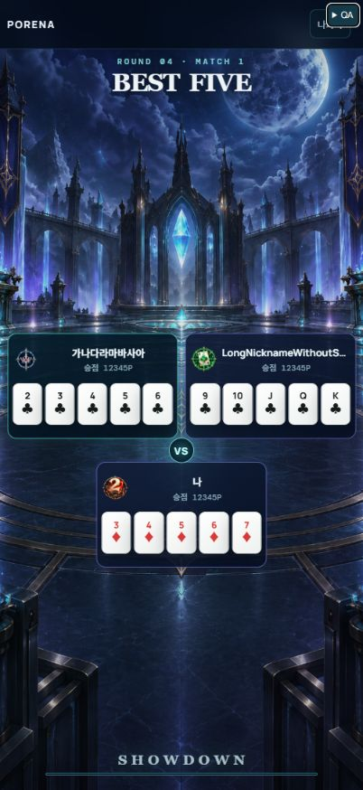
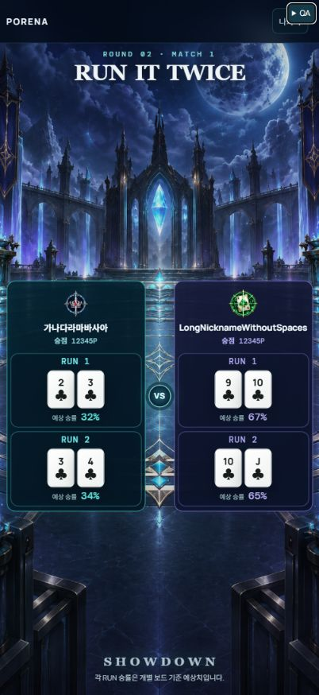
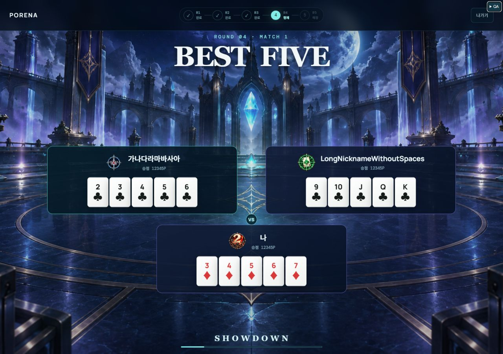

# 매칭 배경·전장 구도 QA — 2026-09-29

## 변경

- 제공 PNG 두 장을 원본 그대로 매칭 전용 public asset으로 복사했다. 파일 SHA256은 각 원본과 동일하다.1024px 미만은모바일,1024px 이상은PC 배경을 사용한다. 쇼다운/상점 배경은 변경하지 않았다.
- 기존 남은 grid 공간 중앙 정렬은 제목/하단 높이 때문에 화면 아래로 치우쳤다. 매칭 그룹 전체의 중심을 배경 바닥 원에 맞춘 viewport 기준점(모바일57dvh,PC62dvh)으로 통일했다. 배경도같은57%/62% position을 사용해 cover 크롭에서 기준점이 유지된다.
- RUN1/2는 전체 양쪽 박스 중심을 같은 기준점으로 정렬한다.3인 그룹은 상단두박스/하단한박스의 전체 경계를 중심 정렬하고 행 간격을 줄였다. VS28px로 아래 프로필 내용을 침범하지 않는다.
- 제목/하단 안내는 명시적으로1·3번째 grid 행에 배치했다. 낮은 넓은R5에서 제목/안내와 겹치는7장4인 그룹은 패딩과 카드 한 줄 압축으로 해결했다.

## 검증

- 실제 서비스 컴포넌트 fixture6상태(R1,R2 RUN,R3,R4 2인/R4 3인,R5)×6viewport(360×780,402×874,840×688,1023×768,1024×768,1280×900) 총36조건에서 페이지 넘침/카드 겹침/박스 크기/배경 URL/그룹 중심/제목·하단 분리를 검사했다.
- 기본 레이아웃 issues는36조건 모두0건. 별도 제목/하단 비교에서840×688 R5가겹쳐 수정했다.840×688/1023×768/1024×768 R5재검사에서 각각 상단252.82/297.22/335.62px,하단531.48/578.28/616.68px로 제목·안내와분리되고 issues0건.
- 1023px에서모바일URL/그룹 중심437.75px,1024px에서PC URL/476.15px 전환 확인.360×780 그룹중심444.60px,402×874 중심498.40px로 RUN·표준매칭 동일.
- 쇼다운 준비/승률18테스트,TypeScript,Worker·클라이언트build 통과. CSS/asset 변경만으로 게임 상태와 규칙은보존했다.
- 꺼져 있던 개발 서버를 재실행했다. localhost:5173 HTTP200 확인. UI검수는127.0.0.1:5173을 사용했다. 사용자 진행 중 게임은 재시작하지 않았다.
- 실제 iPhone Safari/온라인 네트워크 대전은 이번에 검증하지 않았다. 원본 PNG는각약2.4MB이며 리사이즈/재압축은 하지 않았다.

