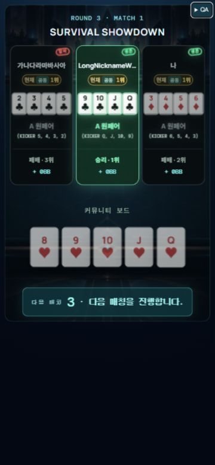

# R3 3인 타이브레이크 QA — 2026-09-29

## 원인과 수정

기존 모바일 CSS가 최종 라운드 외 다인 쇼다운을 세로1열로 배치했고, R4만 가로 예외가 있었다. R3 참여자3명에 `cinema-r3-threeway`를 적용해 세 프로필을 가로3열로 배치했다. 카드4장은 프로필 내부 가용 폭에 맞춘4열 grid/2px gap으로 자동 축소하며 한 줄을 유지한다. 생존·탈락 스탬프가 닉네임을 침범하지 않도록 위쪽 공간을 확보했다.

게임 판정/타이브레이크 참가 조건/보상/서버 상태는 변경하지 않았다. R3 2인과 R4 5장3+2는 기존 배치를 보존한다. 재현용 개발 fixture `showdown-r3-tiebreak`를 추가했다.

## 검증

- R3 3인 fixture: 360×780, 375×811, 402×874, 1280×900 CSS viewport에서 문서 폭/높이가 viewport와 일치하고 레이아웃 issues0건.
- 모바일 각 좌석의 상단은76px로 동일. 각 플레이어4장 카드의 상단도 모두 약157px로 동일해 줄바꿈 없음. 360px 화면에서 카드 폭 약22.96px.
- 보드5장/프로필의 순위/승패/보상/하단 다음 진행 표시를 포함해서 검사했다. 긴 닉네임은 기존 ellipsis/title 동작 유지.
- 360×780 기존 R3 2인/R4 3인 fixture 재검사 issues0건. R4 각5장은3+2 유지.
- cinematicRendering41개 통과(추가 R3 3인 테스트는 전체17장/3좌석/2생존·1탈락 보존 및2인 제외 확인). tsc/변경 파일ESLint/Worker·클라이언트build 통과.
- 실제 사용자의 매치는 이미 다음 라운드로 진행되어 과거 상태를 재실행하지 않았다. 동일 서비스 컴포넌트의 개발 fixture로 검수했다. 실제 iPhone Safari는 미검증.

