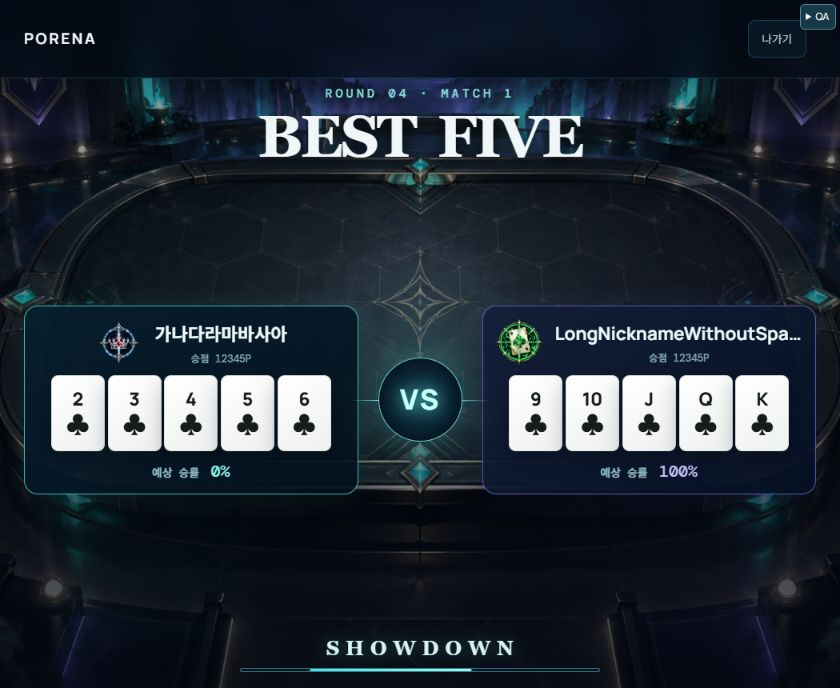
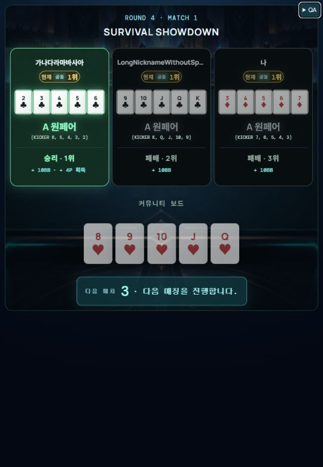

# R4 화면별 카드 배치 QA — 2026-09-29

## 원인·수정

768px 이하의5장 공통3+2 규칙에 매칭 로딩까지 포함되어 있었다. 매칭 hand를 해당 규칙에서 제거하고 R4 round 속성으로5열 한 줄 grid와 왼쪽 아이콘 배치를 적용했다. R4 쇼다운의540px 이상은5열로 덮어쓰며4·5번째 카드의 기존 행 위치 지정도 해제한다. 좁은 쇼다운의3+2는 보존한다.

840×688에서 R4 3인 쇼다운이 약2px 넘치는 것을 발견했다. 높이800px 이하의 넓은 화면에서는 제목·좌석·족보·하단 여백을 압축해 해결했다. 콘텐츠를 숨기거나 게임 데이터/판정/보상을 변경하지 않았다.

## 검증

- R4 2인/3인 매칭 및 쇼다운4상태를360×780,402×874,539×780,540×780,840×688에서 검사. 매칭은항상[5], 쇼다운은539px까지[3,2]/540px부터[5]. 초기840×688 넘침은 수정 후 재검사0건.
- 540×600,840×688,1024×768,1280×900에서2인/3인 매칭과3인 쇼다운 검사. 초기1024×768 넘침은 압축 높이 기준을800px로 조정한 후 재검사0건.
- 360px R3 매칭 및3인 타이브레이크 쇼다운 회귀 issues0건.
- 840px 매칭 양쪽 박스334×188.24px로 동일. 양쪽 스킬 아이콘 오른쪽보다 닉네임 왼쪽이12px 뒤에 위치, 같은 행으로 확인.
- tsc/변경 파일ESLint 통과. ShowdownPrepPanel/showdownEquity/cinematicRendering 타깃59테스트 통과.
- Worker·클라이언트 프로덕션build 통과.
- 실제 서비스 컴포넌트 개발 fixture로 검사했다. 실제 iPhone Safari는 미검증.

