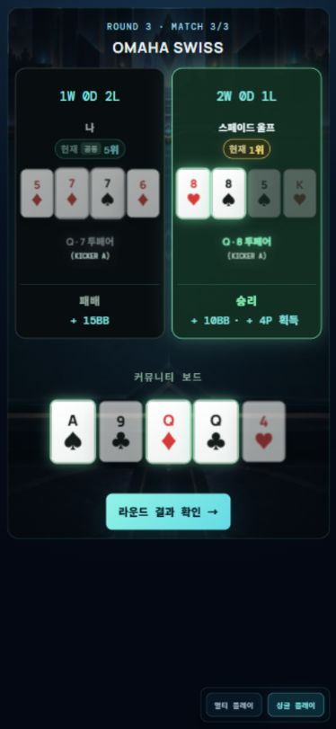

# 쇼다운 프로필·결과 영역 QA — 2026-09-29

## 원인과 수정

프로필에 닉네임·현재 순위·승패를 좁은 고정 행으로 모두 쌓아 카드와 가까워지고 정보 우선순위가 섞였다. 승패를 공통 하단 결과 영역으로 이동해 첫 줄에 표시하고 BB·승점은 둘째 줄에 유지했다. 닉네임과 순위는 최신 지시에 따라 행 간격2px로 묶고, 모바일 카드와의 외부 여백은12px로 분리했다. 기존 대비 총 높이는 유지한다.

R3 플레이어 카드 랭크·문양을 직전 수정보다 추가1px 확대했다. 카드 외곽 크기 및 보드 글꼴은 변경하지 않았다. 결과 공개 플래그, 게임 상태, 승패 판정, 보상 값은 변경하지 않았다. R5의 최종 등수 스탬프는 유지했다.

## 검증

- 실제 진행 중인 R3 Match3 화면375×811: 문서 높이811px, 스크롤 없음. 프로필 높이46px/행 gap2px/카드 쪽 margin12px. 하단 승패와 보상은 분리된 두 줄.
- 360×780: 8개 쇼다운 fixture 상태를 검사한 뒤 최신 순위 간격 수정 후 R2완료/R3/R4삼자 상태를 재검사. 페이지 스크롤·카드 정착 겹침·진행 버튼 이탈 없음.
- 402×874: R1완료, RUN1결과, RUN2리버, R2완료, R3완료, R4삼자, R4헤즈업, R5최종 8개 상태 검사. 페이지 스크롤 없음. R5 등장 애니메이션 중 겹침 보고가 있었으나 종료 후 재검사0건. 다른 상태도 issues0건.
- 1280×900: R2완료/R3완료/R4삼자 검사 모두 issues0건/문서 높이900px.
- R1~R4 결과 표시 단계는 프로필 승패0개, 하단 승패 각 좌석1개. RUN2리버는 결과를 조기 노출하지 않는다. R4 모바일5장은3+2 유지.
- 기존 cinematicRendering 테스트40개 통과. TypeScript/ShowdownCinematic ESLint/클라이언트 및 Worker 빌드 통과. 최신 추가 변경은 CSS 간격만이며 위 브라우저 검수로 확인했다.
- 실제 Safari/iPhone 실기기 및 모든 게임의 처음부터 끝까지 플레이는 검증하지 않았다.

## 글꼴 실측과 문의 답변

375×811 실제 R3에서 커뮤니티 보드 랭크16.2641px/문양21.8403px, 플레이어 카드 랭크12.54px/문양15.64px. 공통 compact 글꼴은 랭크 `clamp(12px,35cqw,20px)`, 문양 `clamp(16px,47cqw,26px)`로 카드 내부 가용 폭에 비례한다. R3 모바일에는 별도 확대 규칙이 적용된다.

카드 외곽 치수와 내부 font-size는 독립적으로 설정할 수 있다. 전체 라운드에 보드 글꼴을 그대로 적용하면5장/7장의 좁은 카드에서 과밀해질 수 있다. 이번 요청은 가능 여부 문의이므로 보드와 플레이어의 글꼴 통일은 추가 적용하지 않았다.

